# Lab 01: Virtual Machines and Compute

## Business Scenario

A small software company is migrating two legacy on-premises servers to Azure. One runs Windows Server hosting an internal application. The other runs Ubuntu hosting a web service. The company has three strict requirements: no public IP exposure on any VM, automated daily backups with a recovery point available within 4 hours, and high availability with automatic failover if one server goes down.

This lab designs and deploys that environment securely using Azure best practices.

---

## Skills Demonstrated

| | |
|:--|:--|
| **Compute & Storage** |     |
| **Networking** |     |
| **Operations** |     |

---

## Architecture

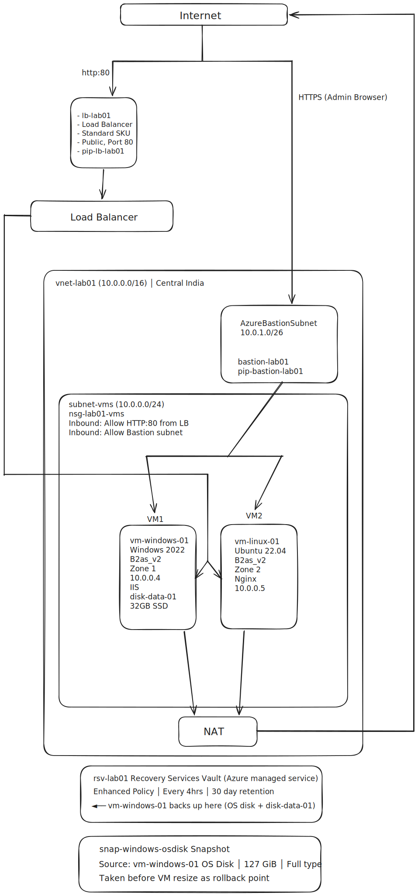

---

## What Was Built

| Resource                | Name                | Details                                         |
| ----------------------- | ------------------- | ----------------------------------------------- |
| Virtual Network         | vnet-lab01          | 10.0.0.0/16, Central India                      |
| VM Subnet               | subnet-vms          | 10.0.0.0/24                                     |
| Bastion Subnet          | AzureBastionSubnet  | 10.0.1.0/26                                     |
| Azure Bastion           | bastion-lab01       | Basic tier, secure browser-based access         |
| Windows VM              | vm-windows-01       | Windows Server 2022, Standard_B2as_v2, Zone 1   |
| Linux VM                | vm-linux-01         | Ubuntu 22.04 LTS, Standard_B2as_v2, Zone 2      |
| Data Disk               | disk-data-01        | 32 GiB Standard SSD ZRS, attached to Windows VM |
| Snapshot                | snap-windows-osdisk | Full snapshot of Windows OS disk                |
| Recovery Services Vault | rsv-lab01           | Locally redundant, Enhanced backup policy       |
| Load Balancer           | lb-lab01            | Standard SKU, Public, Regional                  |
| LB Frontend             | lb-frontend         | Static public IP                                |
| LB Backend Pool         | lb-backend-pool     | Both VMs, Zones 1 and 2                         |
| Health Probe            | hp-http             | HTTP on port 80, 5 second interval              |
| LB Rule                 | lb-rule-http        | TCP port 80 frontend to backend                 |
| NAT Gateway             | nat-lab01           | Outbound internet access for VMs                |
| NSG                     | nsg-lab01-vms       | Subnet-level NSG with HTTP and Bastion rules    |

---

## Screenshots

### Network Setup

The foundation of the entire lab is the virtual network. Before deploying any VM, `vnet-lab01` was created with two subnets: `subnet-vms` for the workload VMs and `AzureBastionSubnet` for the Bastion host. Bastion was enabled during VNet creation rather than separately, which is the cleaner approach as it provisions both the subnet and the Bastion resource in a single operation. The address space of `10.0.0.0/16` gives room for additional subnets in future labs.

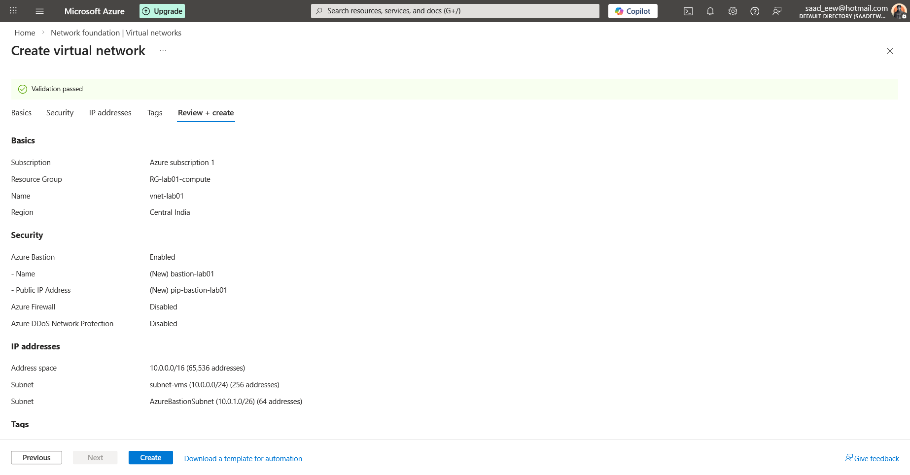

_VNet review page confirming subnet-vms, AzureBastionSubnet, and Bastion all configured before creation_

A subnet-level NSG was attached to `subnet-vms` to control all traffic into and out of both VMs from a single policy point. The single custom inbound rule allows HTTP on port 80 from any source, which is required for the load balancer health probe and public web traffic. All other inbound traffic is denied by the default `DenyAllInBound` rule at priority 65500. On the outbound side, only VNet-internal and internet-bound traffic is permitted — outbound internet flows through the NAT Gateway rather than directly from the VMs.

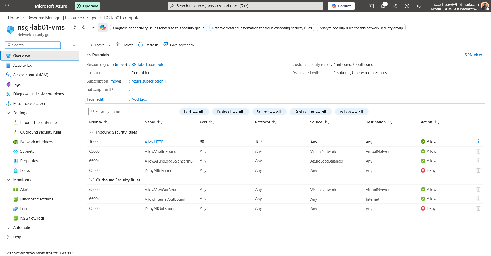

_nsg-lab01-vms inbound and outbound rules: one custom AllowHTTP rule on port 80, all other inbound denied by default; outbound permits VNet and internet traffic via NAT Gateway_

---

### Virtual Machine Deployment

Both VMs were deployed with security and availability as the primary design principles. No public IP addresses were assigned to either VM. All administrative access goes through Bastion. Each VM was placed in a separate Availability Zone to ensure they never share the same physical failure domain. The Windows VM went into Zone 1 and the Linux VM into Zone 2, meaning a datacenter-level failure can only take down one of them at a time.

Both VMs were tagged with `Lab: Lab01` and `Environment: Learning` at deployment. This is not cosmetic. In Lab 04 we will enforce mandatory tagging via Azure Policy, so establishing the habit early matters.

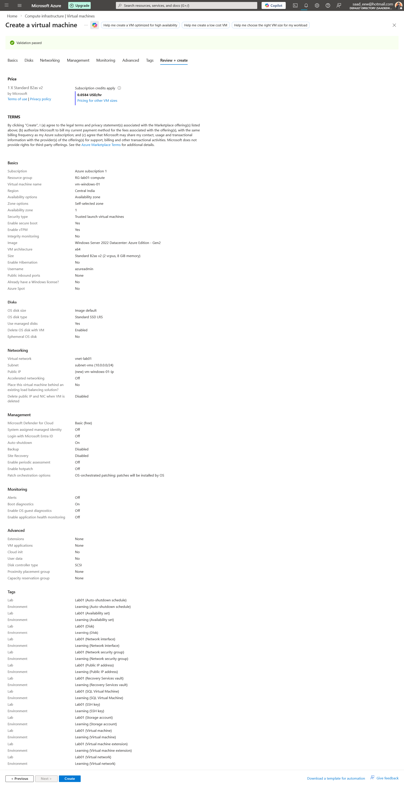

_Windows VM review: Zone 1, Trusted launch security type, Standard_B2as_v2, no public IP, auto-shutdown enabled at 7:00 PM PKT_

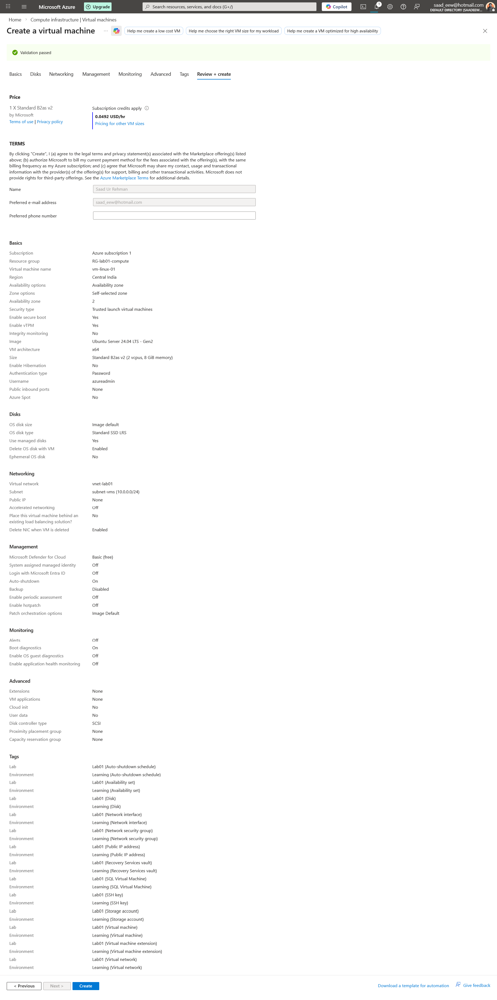

_Linux VM review: Zone 2, Ubuntu 22.04 LTS Gen2, Standard_B2as_v2, password authentication, no public IP_

---

### Disk Operations

A 32 GiB Standard SSD data disk was attached to `vm-windows-01` to simulate the company's application data volume. Attaching a disk in Azure only makes it available to the OS. The disk must be initialized and formatted inside the operating system before it can hold data, which is exactly what happens in production when a new disk is added to a running server.

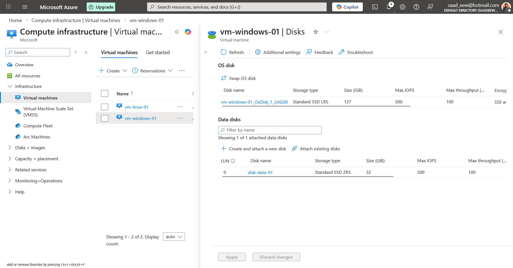

_Disks blade showing the OS disk alongside the newly attached 32 GiB data disk (disk-data-01) on Standard SSD ZRS_

The Windows VM was accessed via Bastion directly in the browser. Inside Windows Disk Management, the new disk appeared as Unknown and Uninitialized. MBR partition style was selected and the disk was formatted as NTFS and assigned drive letter E.

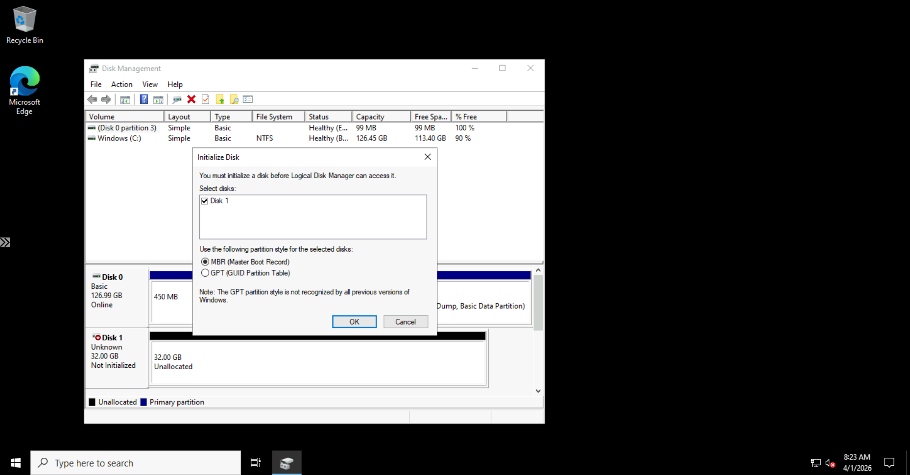

_Windows Disk Management inside vm-windows-01 via Bastion session: Disk 1 detected as 32 GiB uninitialized, MBR selected_

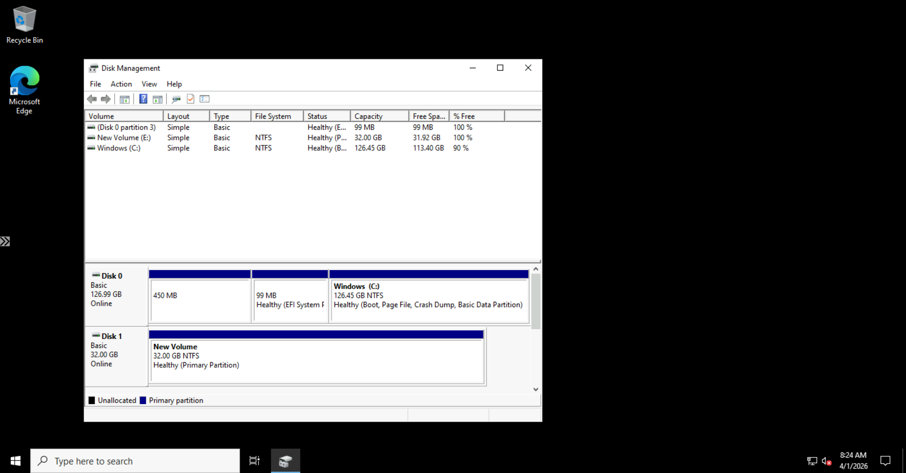

_Disk 1 successfully initialized and formatted: New Volume (E:), 32 GiB NTFS, Healthy Primary Partition_

The Linux VM was accessed the same way through Bastion. Running `lsblk` confirms the disk layout and verifies the Bastion connection is working as the sole access method. No SSH port is open anywhere.

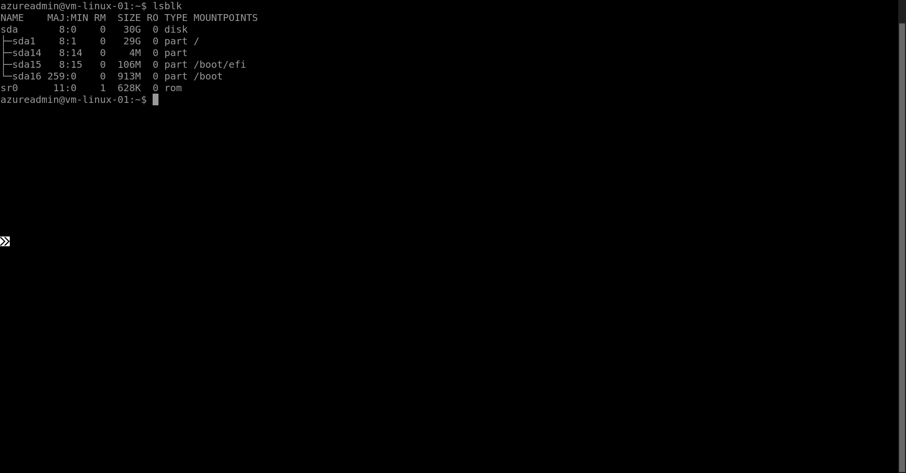

_vm-linux-01 connected via Bastion browser session: lsblk output showing sda (30 GiB OS disk) with partitions mounted_

---

### VM Resize

Before resizing, a snapshot of the Windows OS disk was taken as a rollback point. VM resizing in Azure changes the underlying hardware profile and always triggers a restart. In a production environment this would be scheduled during a maintenance window with application teams notified. In this lab it demonstrates the resize workflow and the importance of having a restore point before making hardware-level changes.

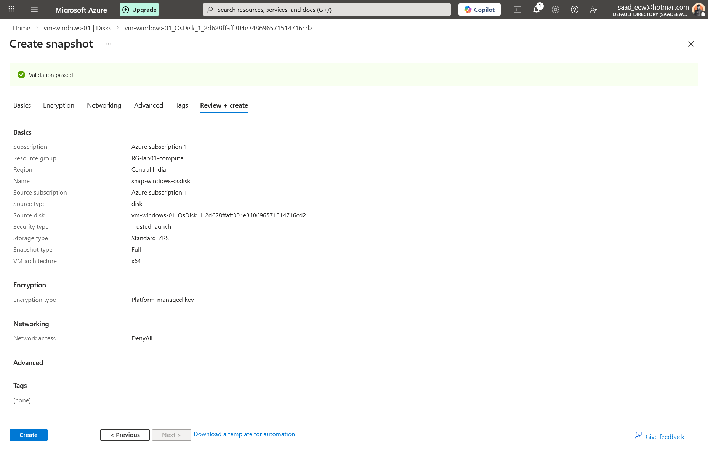

_Snapshot configuration before resize: Full type, Standard ZRS storage, DenyAll network access, Trusted launch security preserved_

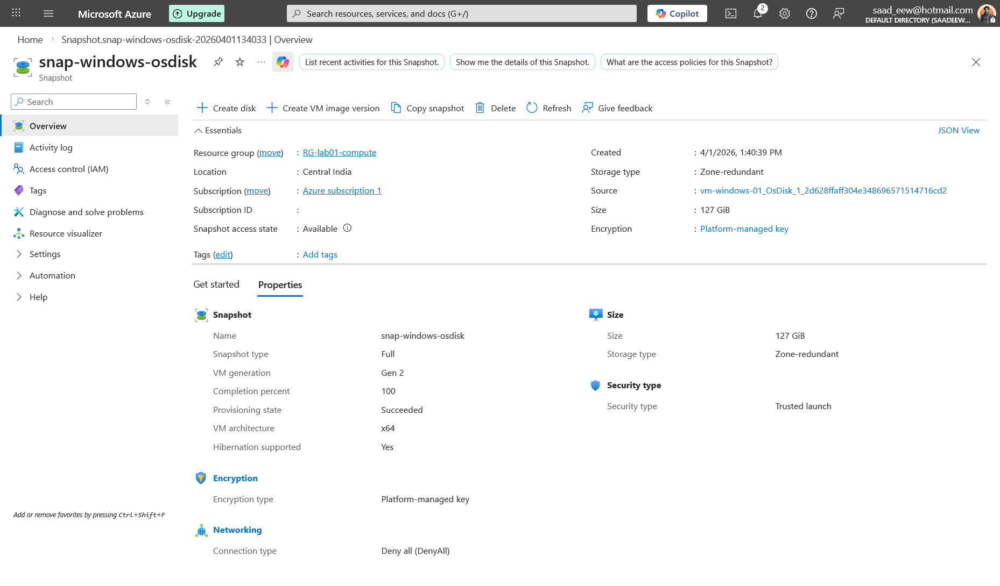

_snap-windows-osdisk created successfully: 127 GiB, Provisioning state Succeeded, source disk confirmed_

With the snapshot in place, the VM was resized through the portal Size blade. The confirmation dialog makes clear that a running VM will restart, which is the expected behavior.

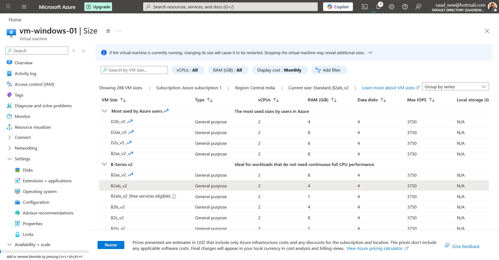

_Size selection blade showing 288 available SKUs for Central India, filtered by B-Series v2 for cost efficiency_

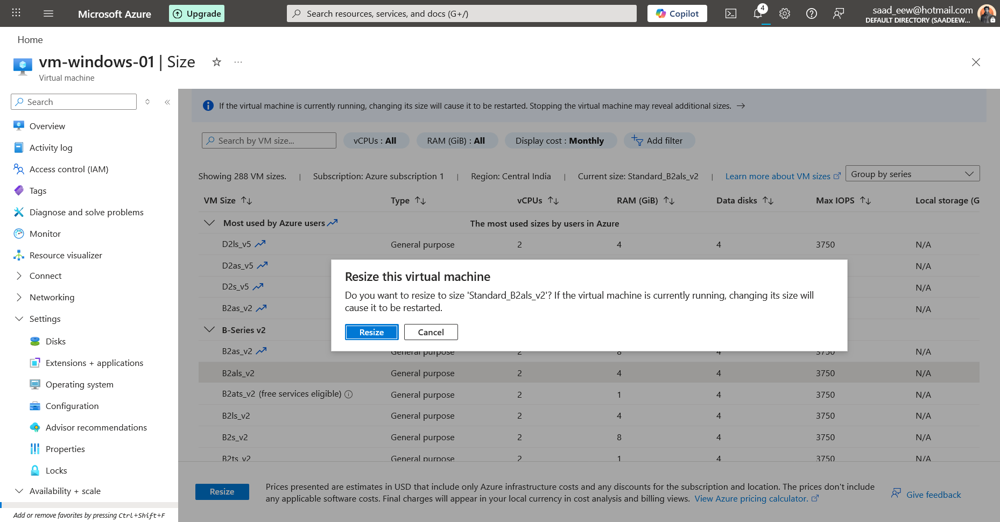

_Portal confirmation: resizing to Standard_B2als_v2 will restart the VM_

After the resize completed and the VM came back online, the new size was confirmed in the portal overview.

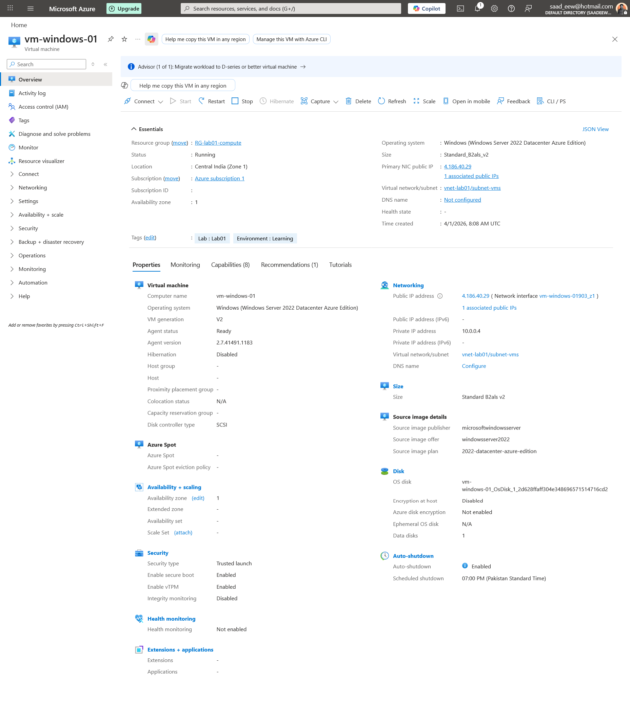

_vm-windows-01 overview post-resize: new size confirmed, Status Running, all settings intact_

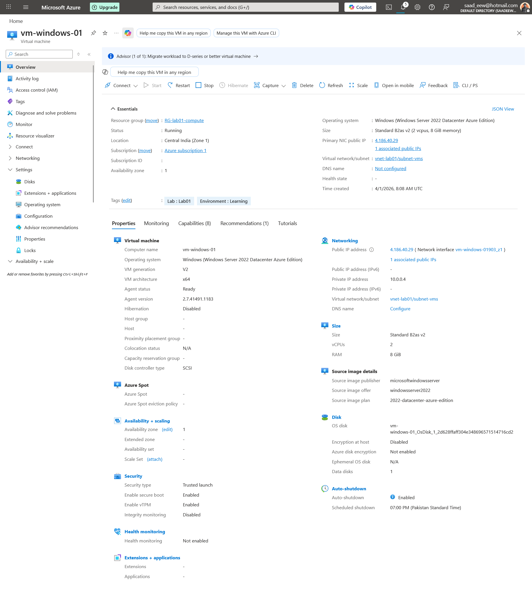

_Full dashboard view: Zone 1, Trusted launch, 1 data disk, auto-shutdown enabled, Lab and Environment tags visible_

---

### Backup

The company's requirement of a 4-hour recovery objective drove the backup configuration. A Recovery Services Vault was deployed in the same region as the VMs. The Enhanced backup policy was chosen over Standard because the VMs use Trusted Launch security type, which Standard policy does not support. Enhanced policy also enables multiple backups per day and application-consistent snapshots, which capture the state of running applications rather than just the disk.

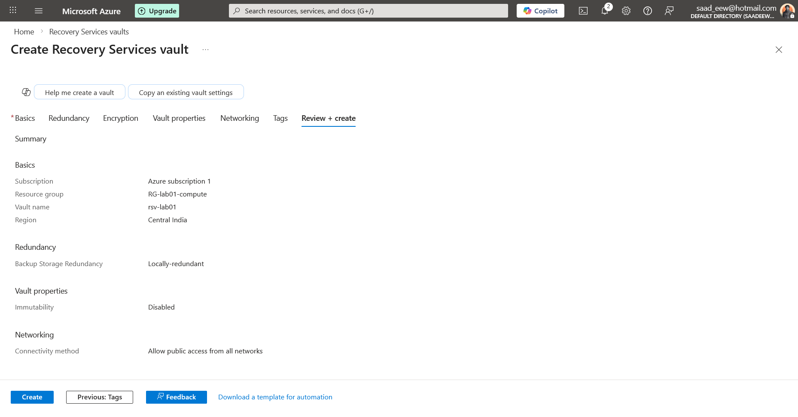

_rsv-lab01 review page: Locally redundant storage, public network access, Central India_

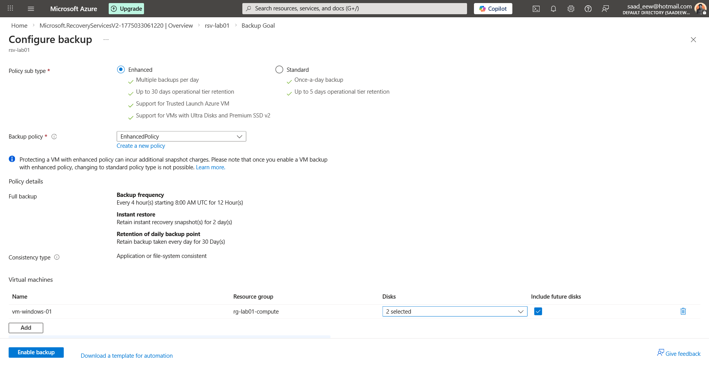

_Enhanced policy configured for vm-windows-01: backup every 4 hours starting 8:00 AM UTC, 30-day daily retention, application consistent_

An on-demand backup was triggered immediately after enabling backup to generate the first restore point and verify the pipeline works end to end.

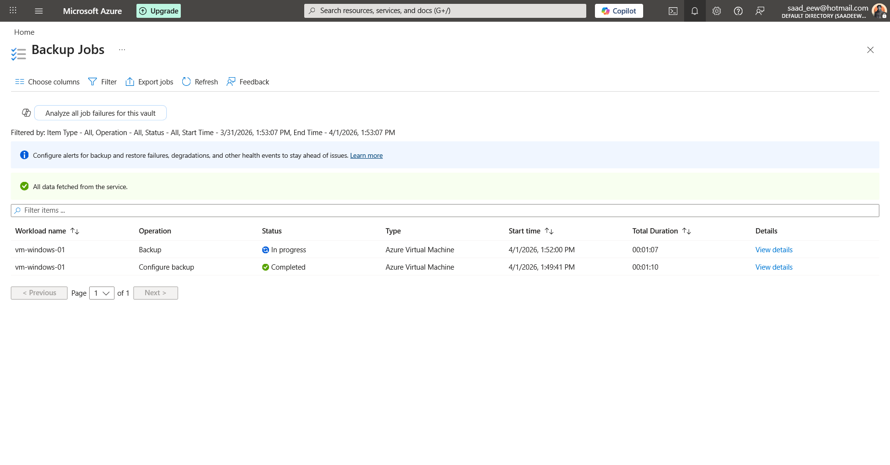

_Backup Jobs view: Configure backup completed in 1 minute 10 seconds, first Backup job running_

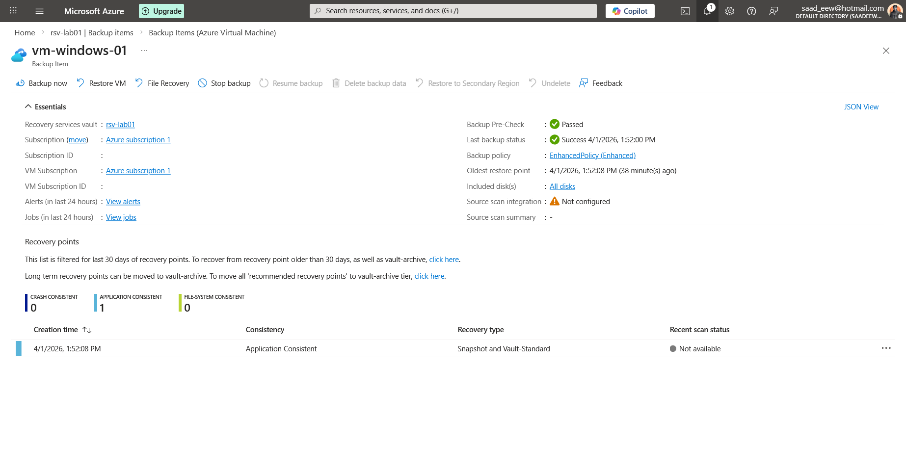

_vm-windows-01 backup item: Last backup status Success at 1:52 PM, 1 Application Consistent restore point available, all disks included_

---

### Load Balancer

The load balancer is the component that satisfies the high availability requirement. Traffic from the internet hits a single public frontend IP and the load balancer distributes it across both VMs using round-robin. If one VM becomes unhealthy, the HTTP health probe detects it within seconds and stops sending traffic to that VM until it recovers.

The Standard SKU was the only viable choice here. Basic SKU is being deprecated, does not support Availability Zones, and cannot integrate with NAT Gateway. The health probe was configured as HTTP rather than TCP because HTTP probes verify the application is responding, not just that the port is listening.

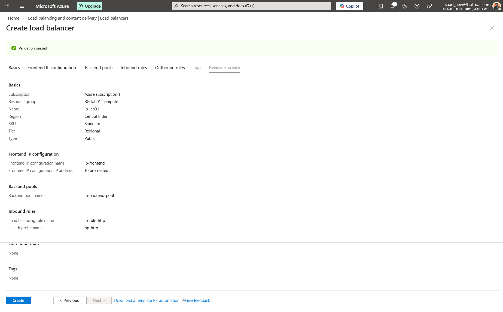

_lb-lab01 review: Standard SKU, Public, Regional, frontend lb-frontend, backend pool lb-backend-pool, rule lb-rule-http, probe hp-http_

Once deployed, both VMs were added to the backend pool. The portal shows each VM's availability zone, confirming cross-zone distribution is in place.

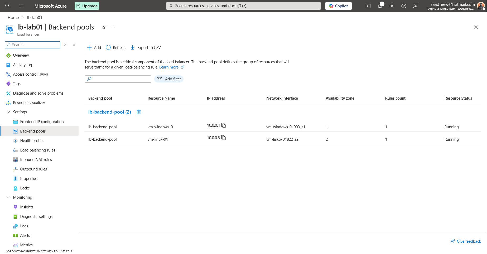

_Backend pool: vm-windows-01 in Zone 1 (10.0.0.4) and vm-linux-01 in Zone 2 (10.0.0.5), both Running_

The health probe confirmed both VMs were responding correctly before any traffic was sent.

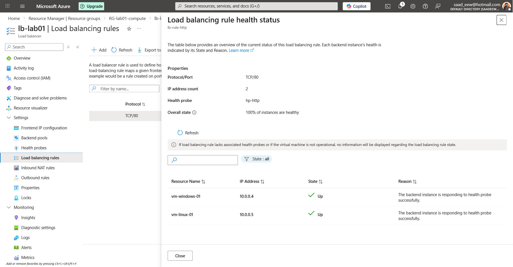

_Load balancing rule health status: 100% of instances healthy, both VMs responding to HTTP health probe on port 80_

With both web servers running (Nginx on Linux, IIS on Windows), the load balancer was tested by hitting the frontend public IP from a browser. The same IP returned different responses on successive refreshes, confirming traffic distribution across both VMs.

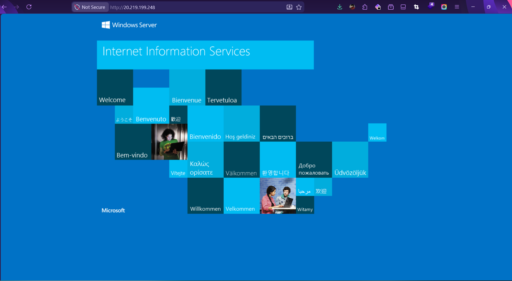

_Browser hitting lb-lab01 frontend IP: IIS default page served from vm-windows-01, confirming the load balancer is routing traffic to the Windows backend_

The same frontend IP was refreshed and returned a different response, this time from the Linux VM, confirming round-robin distribution across both VMs.

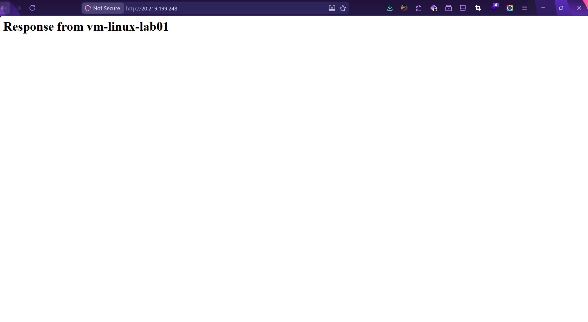

_Same frontend IP on next request: Nginx response from vm-linux-01, proving the load balancer is distributing traffic across both VMs_

The Load Balancer Insights blade provides a topology view of the full path from frontend through the rule to the backend pool and individual VMs.

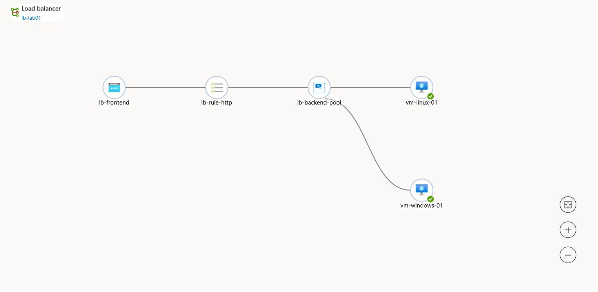

_Insights topology: lb-frontend to lb-rule-http to lb-backend-pool, both vm-linux-01 and vm-windows-01 showing green health indicators_

Azure Monitor metrics provide a time-series view of health probe status confirming both backends were healthy throughout the test.

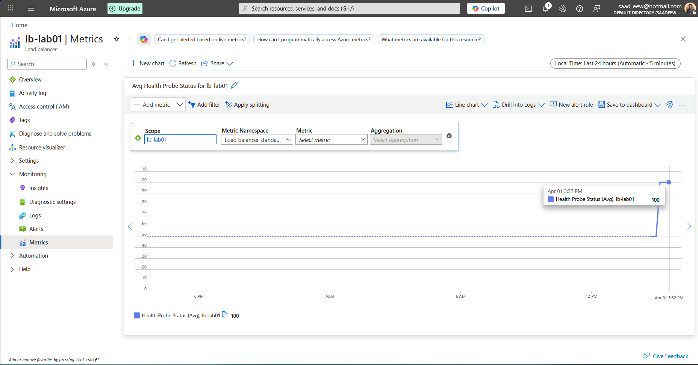

_Azure Monitor metrics chart showing average Health Probe Status for lb-lab01, confirming both backends remained healthy throughout the load balancer test_

**Failover test:** `vm-linux-01` was stopped from the portal. After approximately 2 minutes the HTTP health probe detected the VM as unhealthy and removed it from the rotation. The health status view updated to show only `vm-windows-01` as Up.

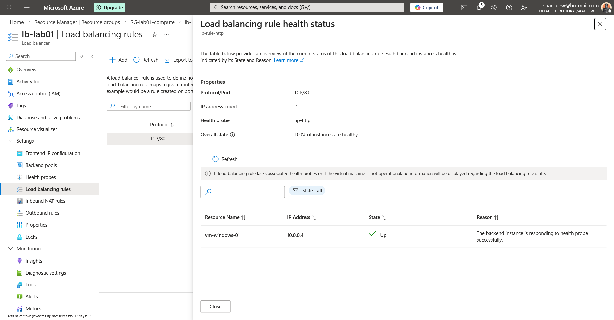

_After stopping vm-linux-01: health status shows only vm-windows-01 Up, proving automatic failover works as designed_

---

### Resource Group Overview

With all components deployed, the resource group gives a complete picture of everything built in this lab. 18 resources covering compute, networking, storage, and operations.

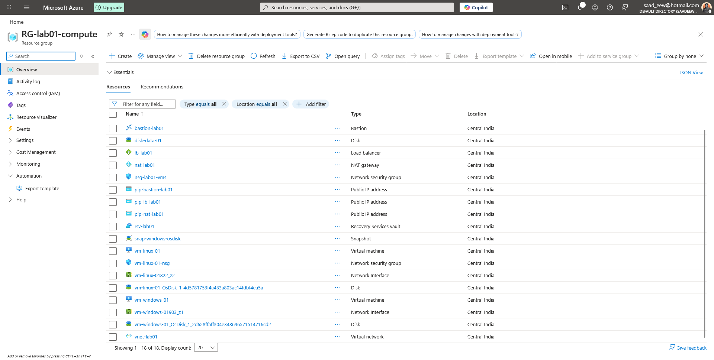

_RG-lab01-compute: all 18 resources deployed including Bastion, VMs, disks, load balancer, NAT gateway, NSG, public IPs, Recovery Services vault, snapshot, network interfaces, and VNet_

---

### Troubleshooting Evidence

During the lab two real configuration issues were encountered. Both are documented in detail in the Troubleshooting section below. The screenshots below provide visual evidence of each issue.

The first was an unintended public IP assigned to `vm-windows-01` during creation despite selecting None. It was discovered when the NAT Gateway deployment hit the free tier quota limit of 3 public IPs.

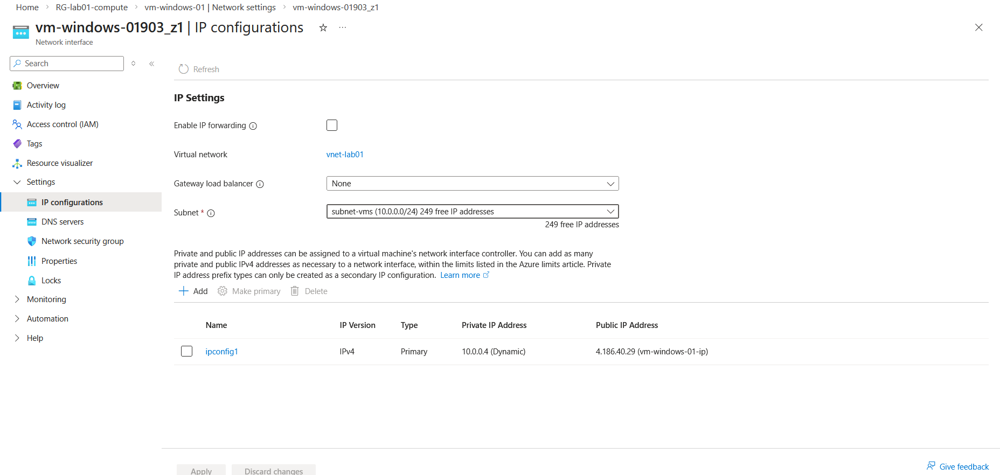

_NIC IP configuration showing the unintentionally assigned public IP (vm-windows-01-ip) before removal_

The second was `vm-linux-01` losing outbound internet access after joining the Standard Load Balancer backend pool, preventing `apt update` from running. Deploying the NAT Gateway resolved it.

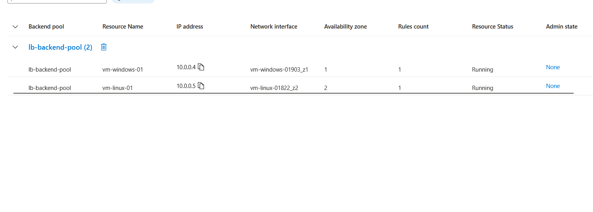

_Backend pool confirming both VMs Running in their correct availability zones after NAT Gateway restored outbound connectivity_

---

<strong>Key Decisions</strong>

 

**Why Azure Bastion instead of public RDP or SSH?**

RDP on port 3389 and SSH on port 22 are among the most scanned ports on the internet. Exposing them publicly invites brute force attacks and credential stuffing. Bastion provides a fully managed browser-based connection over HTTPS with no inbound ports required on the VMs. The VMs have no public IP addresses at all.

---

**Why Availability Zones over Availability Sets?**

Availability Zones protect against full datacenter failure. Each zone is a physically separate datacenter within the same region with independent power, cooling, and networking. Availability Sets only protect against rack-level failures within a single datacenter. For a migration scenario where uptime matters, Zones provide the stronger guarantee. Windows VM was placed in Zone 1 and Linux in Zone 2 to ensure they never share the same physical failure domain.

---

**Why Standard SKU Load Balancer over Basic?**

Microsoft is deprecating the Basic SKU. Standard supports Availability Zones, has a 99.99% SLA, supports larger backend pools, provides richer health probe options, and integrates with NAT Gateway for outbound access. Basic has none of these. All new deployments should use Standard.

---

**Why a NAT Gateway for outbound internet?**

When VMs are placed in a Standard Load Balancer backend pool, they lose default outbound internet access. This is a security feature, not a bug. Without a NAT Gateway, VMs cannot reach the internet for OS updates, package installs, or external services. NAT Gateway provides a dedicated, predictable outbound IP while keeping VMs completely private with no inbound exposure.

---

**Why take a snapshot before resizing?**

VM resizing changes the underlying hardware profile and forces a restart. If the resize causes instability or application failure, there is no built-in rollback. A snapshot taken before the resize operation provides an instant restore point for the OS disk. In production this would be scheduled during a maintenance window.

---

**Why Standard SSD over Premium SSD?**

Cost optimization. Premium SSD is designed for production workloads requiring sub-millisecond latency and high IOPS. Lab workloads have no such requirements. Standard SSD provides adequate performance at roughly 60% of the cost of Premium. The data disk uses ZRS (Zone Redundant Storage) which provides additional redundancy at minimal extra cost.

---

**Why HTTP health probe on port 80?**

HTTP probes are more reliable than TCP probes for web workloads. A TCP probe only checks that the port is open. An HTTP probe checks that the application is actually responding with a valid status code. A VM where the web server has crashed but the port is still bound would pass a TCP probe but fail an HTTP probe. The HTTP probe is the correct choice here.

---

**Why Enhanced backup policy over Standard?**

Enhanced policy supports Trusted Launch VMs which is the security type used in this lab. Standard policy does not. Enhanced also supports multiple backups per day and longer operational tier retention, which aligns with the 4-hour recovery objective in the business scenario.

---

**Why password authentication on the Linux VM?**

SSH key authentication is the correct and expected practice for Linux VMs in any real environment. It eliminates the risk of brute-force credential attacks and is the default recommendation in every Azure security baseline. Password authentication was used here solely for lab simplicity — no production workload, no exposed SSH port, and access is restricted entirely to Bastion. In a real migration this would be SSH keys from day one.

---

**Why HTTP only and not HTTPS?**

TLS termination was intentionally out of scope for this lab. The focus here is VM deployment, availability, and backup fundamentals. In a production migration, HTTPS would be configured at the load balancer frontend, the correct pattern being an Azure Application Gateway with WAF and TLS offloading, or a Let's Encrypt certificate deployed on each VM. Introducing certificate management here would conflate two separate concerns. HTTPS and Application Gateway are covered in a dedicated networking lab.

---

<strong>Troubleshooting</strong>

 

**Problem: Load balancer not returning a response from vm-windows-01**

IIS was installed and running. The Azure NSG inbound rule for port 80 was in place. The health probe still showed the VM as healthy. However, browsing the load balancer frontend IP returned no response from the Windows VM while Linux responded correctly.

Investigation: Verified IIS was running with `Get-Service W3SVC` inside the VM via Bastion. Confirmed the NSG rule existed. Checked the health probe status which showed both VMs as Up.

Resolution: After a hard browser refresh and waiting approximately 2 minutes the load balancer began routing to both VMs correctly. The exact cause is uncertain. Likely explanation: the browser was serving a cached response, or the session persistence was temporarily pinning traffic to the Linux VM. Both VMs confirmed healthy in the backend pool immediately after.

**Learning:** Azure Load Balancer session behavior can be affected by browser caching. Always test with a hard refresh (Ctrl+Shift+R) and consider using curl or a private browser window for more reliable testing.

---

**Problem: Linux VM could not download packages (apt update failing)**

After placing both VMs in the Standard Load Balancer backend pool, the Linux VM lost outbound internet access. `sudo apt update` timed out with no connection.

Root cause: Standard Load Balancer removes default outbound internet access from VMs in its backend pool. This is by design and is a security feature. VMs with no public IP and no outbound rule have no internet access.

Resolution: Deployed a NAT Gateway (`nat-lab01`) with a dedicated public IP (`pip-nat-lab01`) and associated it with `subnet-vms`. After NAT Gateway deployment, `sudo apt update` and `sudo apt install nginx` completed successfully.

**Learning:** Standard Load Balancer plus NAT Gateway is the correct enterprise pattern for private VMs that need outbound access. Do not assign public IPs to backend pool VMs for this purpose.

---

**Problem: vm-windows-01 had an unintended public IP assigned**

During VM creation the portal assigned a new public IP (`vm-windows-01-ip`) despite selecting None. This was discovered when hitting the free tier public IP quota limit of 3 while trying to create the NAT Gateway.

Resolution: Navigated to the VM NIC IP configuration, removed the public IP association, then deleted the unassociated public IP to free up the quota slot.

**Learning:** Always verify the Networking tab review screen before creating a VM. The portal occasionally defaults back to creating a new public IP. Removing it post-creation works fine but costs time.

---

<strong>Cost</strong>

 

| Resource                         | Estimated Cost                      |
| -------------------------------- | ----------------------------------- |
| vm-windows-01 (Standard_B2as_v2) | Free tier credits applied           |
| vm-linux-01 (Standard_B2as_v2)   | Free tier credits applied           |
| Azure Bastion (Basic tier)       | ~$0.19/hr when active               |
| Standard Load Balancer           | ~$0.008/hr + data processing        |
| NAT Gateway                      | ~$0.045/hr + data processing        |
| Recovery Services Vault          | Minimal for first backup            |
| Snapshots and disks              | Minimal Standard SSD pricing        |
| **Total lab cost**               | **Under $3 with free tier credits** |

Both VMs are configured with auto-shutdown at 7:00 PM PKT and were manually deallocated after each session to minimize compute charges. Bastion and NAT Gateway were deleted after lab completion to stop hourly billing.

