# Lab 02: Hub-Spoke Network with Zero-Trust Segmentation

## Business Scenario

A mid-sized company with three departments (IT, Finance, and HR) is moving to Azure. Finance and HR must be completely isolated from each other but both need access to shared IT services like monitoring and management tooling. The company also has a small on-premises office that needs secure access to the hub without being able to reach the department workloads directly.

Three additional requirements: no public IP on any workload VM, all internet-bound traffic from departments must pass through a central inspection point, and every access control must be documented and provable with tooling rather than assumed.

This lab designs and deploys that environment using a hub-spoke topology, NSG-enforced segmentation, user-defined route forced tunnelling, and Azure Network Watcher for verification.

---

## Skills Demonstrated

| | |
|:--|:--|
| **Networking** |     |
| **Security** |     |
| **Operations** |     |

---

## Architecture

<strong>Click to view architecture diagram</strong>

 

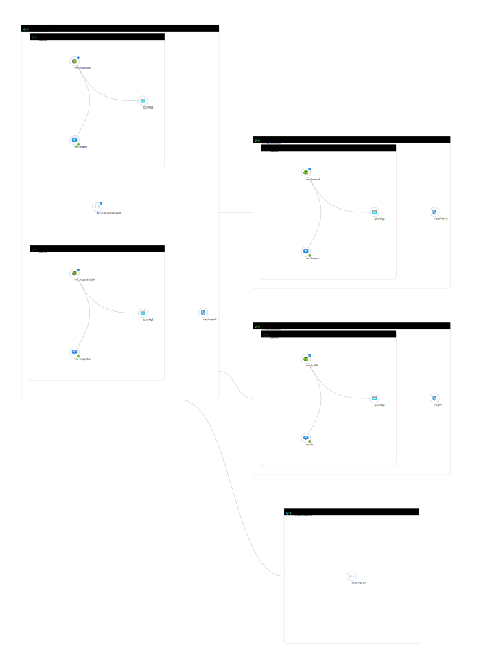

---

## What Was Built

| Resource | Name | Details |
|---|---|---|
| Virtual Network | vnet-hub | 10.0.0.0/16, Central India: hub for all shared services |
| Virtual Network | vnet-spoke-finance | 10.1.0.0/16, Central India: Finance department |
| Virtual Network | vnet-spoke-hr | 10.2.0.0/16, Central India: HR department |
| Virtual Network | vnet-onprem-sim | 10.3.0.0/16, Central India: simulated on-premises office |
| VNet Peering | hub-to-finance | Bidirectional, forwarded traffic enabled, no gateway transit |
| VNet Peering | hub-to-hr | Bidirectional, forwarded traffic enabled, no gateway transit |
| VNet Peering | hub-to-onprem | Bidirectional, forwarded traffic enabled, no gateway transit |
| Linux VM | vm-inspection | Ubuntu 24.04 LTS, Standard DC1ds v3, snet-inspect: NVA/router |
| Windows VM | vm-finance | Windows Server 2022, Standard DC1ds v3, snet-finance: Finance workload |
| Windows VM | vm-hr | Windows Server 2022, Standard DC1ds v3, snet-hr: HR workload |
| Windows VM | vm-mgmt | Windows Server 2022, Standard DC1ds v3, snet-mgmt: shared management |
| NSG | nsg-finance | Subnet-level, Finance isolation rules |
| NSG | nsg-hr | Subnet-level, HR isolation rules |
| NSG | nsg-inspect | Subnet-level, NVA inbound + internet egress rules |
| Route Table | rt-finance | 0.0.0.0/0 → Virtual appliance 10.0.1.4, associated with snet-finance |
| Route Table | rt-hr | 0.0.0.0/0 → Virtual appliance 10.0.1.4, associated with snet-hr |
| NAT Gateway | nat-cent | Outbound internet for snet-mgmt |
| Log Analytics Workspace | law-hubspoke | Centralised log collection: hub shared service |
| Data Collection Rule | dcr-hubspoke-lab | Windows Event Logs from vm-finance and vm-hr to law-hubspoke |
| Azure Bastion | vnet-hub-Bastion | Standard SKU, hub VNet: covers all peered spokes |

---

## Screenshots

### Network Foundation

Four VNets were created before any VM was deployed. Address spaces were planned to avoid any overlap, which is a hard requirement for VNet peering. The hub takes 10.0.0.0/16, Finance takes 10.1.0.0/16, HR takes 10.2.0.0/16, and the on-premises simulation takes 10.3.0.0/16. Each spoke has a single workload subnet. The hub has three: one for Azure Bastion, one for the inspection VM, and one for the management VM and shared services.

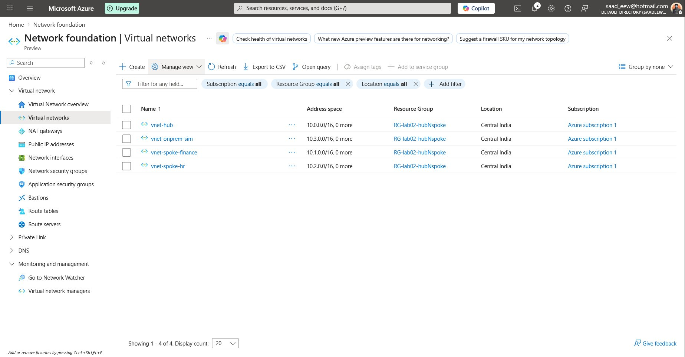

_Network foundation view showing all four VNets with their non-overlapping address spaces in the same resource group and region_

---

### VNet Peering

Peering was configured from the hub to each spoke in a single operation that creates both directions simultaneously. All three peerings show Fully Synchronized and Connected. The gateway transit option was left disabled on all peerings because there is no VPN Gateway in this lab: enabling it without a gateway causes a deployment error.

Forwarded traffic was enabled on both sides of every peering. This is required so that traffic from spoke VMs, after being redirected to vm-inspection by a UDR, can return through the peering back to its destination. Without this setting the return path is dropped silently.

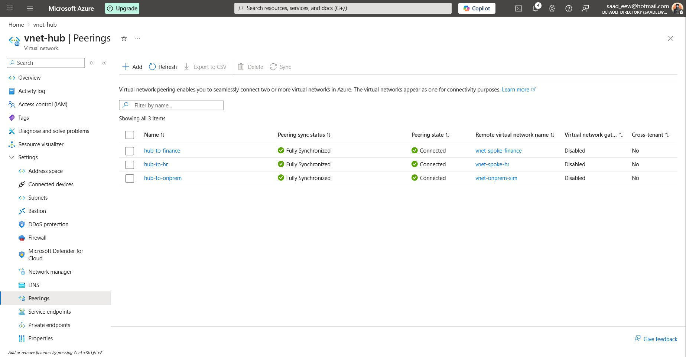

_vnet-hub Peerings blade showing hub-to-finance, hub-to-hr, and hub-to-onprem all Connected and Fully Synchronized_

---

### Virtual Machine Deployment

All four VMs were deployed with no public IP. The only access method is Azure Bastion. vm-inspection was given a static private IP of 10.0.1.4 because the UDR in both spoke route tables hardcodes this address as the next hop. If it were dynamic it could change on restart and silently break forced tunnelling.

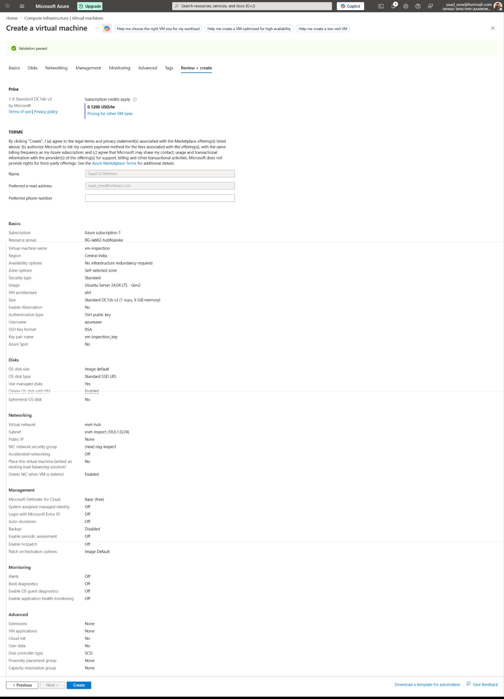

_vm-inspection review: Ubuntu 24.04 LTS, vnet-hub, snet-inspect, no public IP, SSH key authentication, nsg-inspect attached at creation_

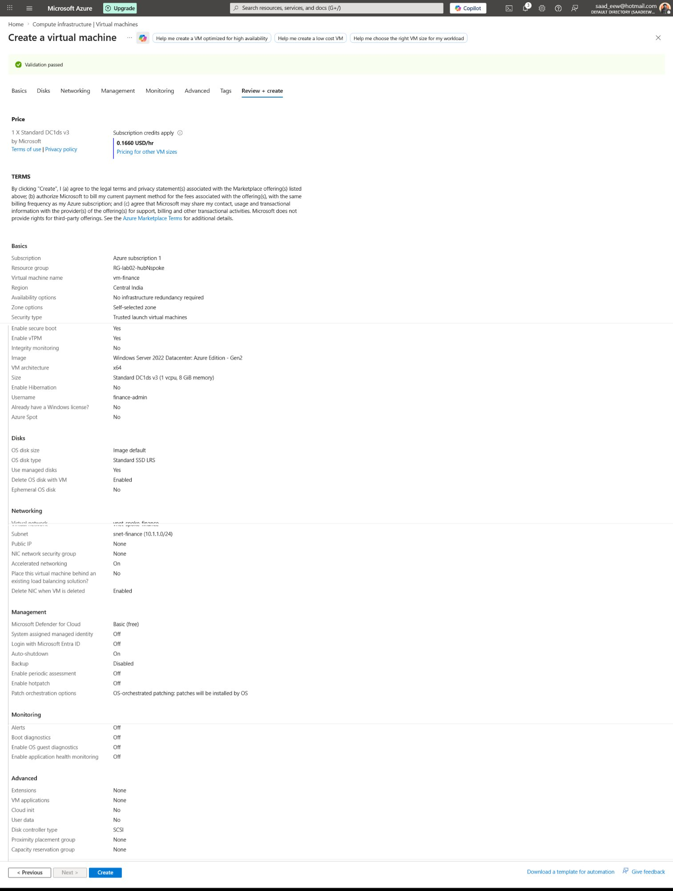

_vm-finance review: Windows Server 2022, vnet-spoke-finance, snet-finance (10.1.1.0/24), no public IP, no NSG at NIC level (NSG applied at subnet level in Phase 5)_

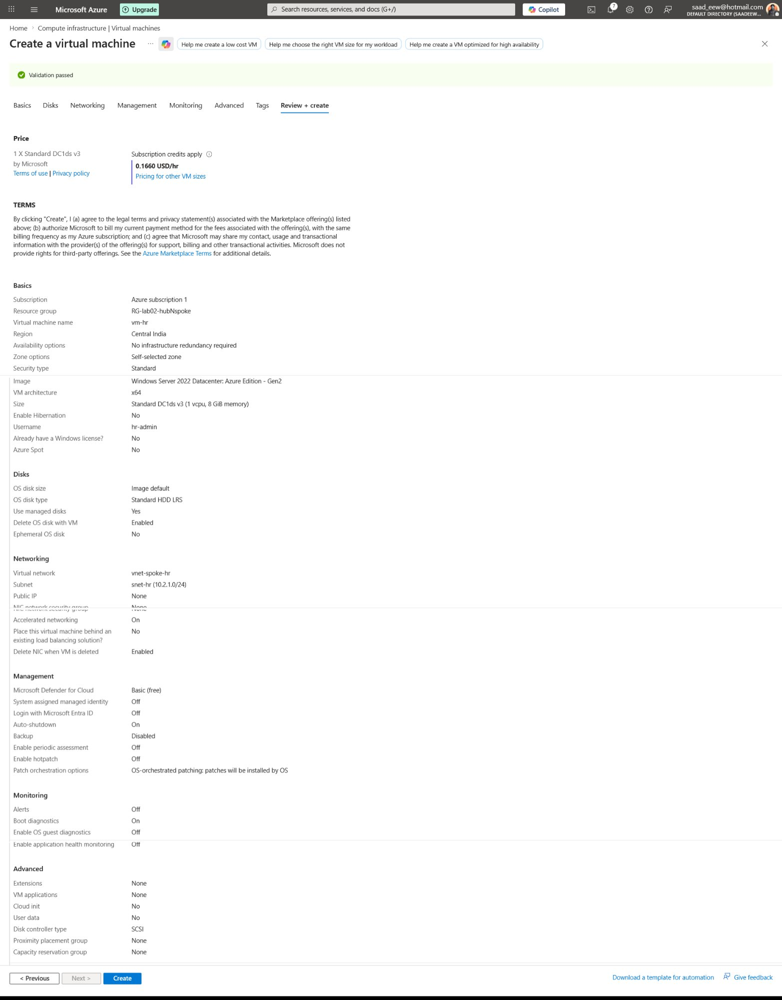

_vm-hr review: Windows Server 2022, vnet-spoke-hr, snet-hr (10.2.1.0/24), no public IP_

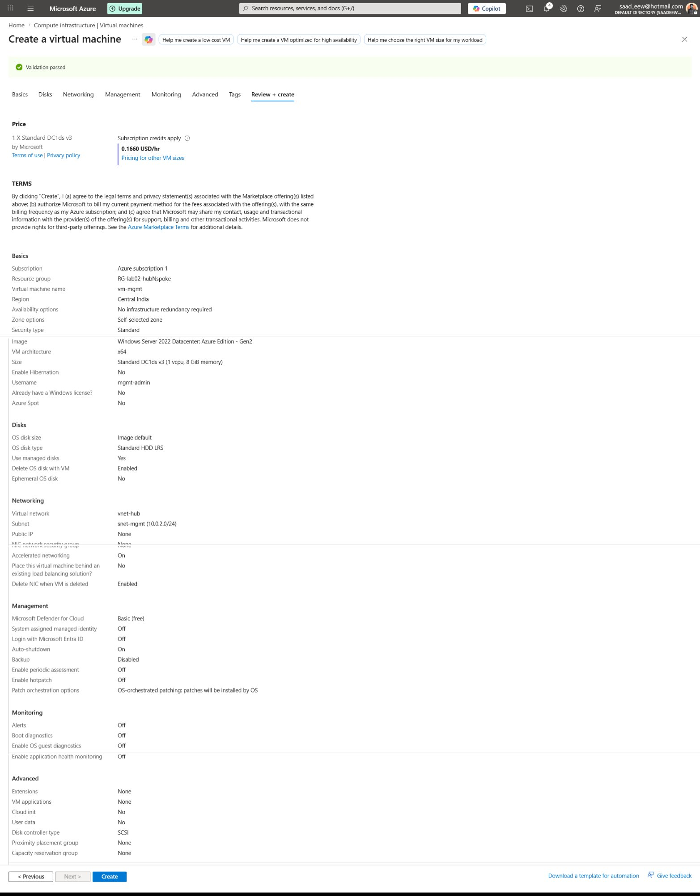

_vm-mgmt review: Windows Server 2022, vnet-hub, snet-mgmt (10.0.2.0/24), no public IP (acts as the shared IT management host)_

---

### IP Forwarding on the NVA

vm-inspection acts as a network virtual appliance. For it to forward packets that are not addressed to its own IP, IP forwarding must be enabled in two separate places. The Azure platform setting tells Azure to deliver packets to the NIC even when the destination IP is not the NIC's own address. The kernel setting tells the Linux OS to forward those packets onward rather than dropping them.

Enabling only one of the two causes silent packet drops with no error message. This is one of the most common misconfiguration points in NVA setups.

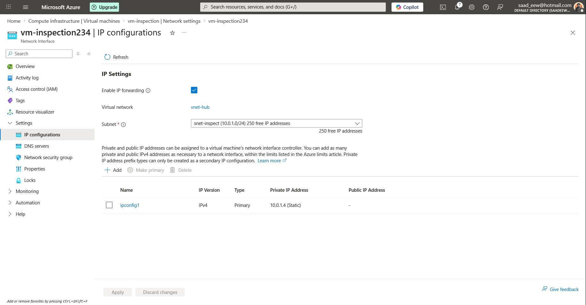

_vm-inspection234 NIC IP configurations: Enable IP forwarding checked, private IP 10.0.1.4 Static, platform-level forwarding enabled_

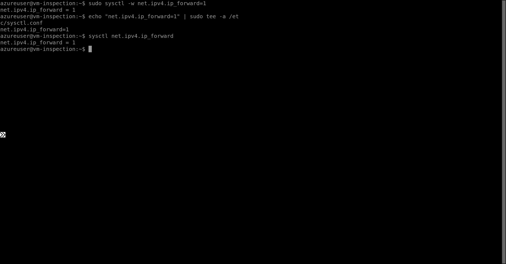

_Bastion SSH session to vm-inspection: sysctl confirms net.ipv4.ip_forward = 1; kernel-level forwarding enabled and persisted to /etc/sysctl.conf_

---

### Network Security Groups

NSGs were applied at the subnet level rather than the NIC level. Subnet-level NSGs apply to every VM in the subnet automatically, which is cleaner to manage and audit. The rules follow a layered pattern: specific allows at low priority numbers, explicit department-to-department denies in the middle, and a blanket deny-all at 4096. The deny-all at 4096 overrides the Azure default AllowVnetInBound at 65000, making the Finance and HR subnets isolated by default rather than open by default.

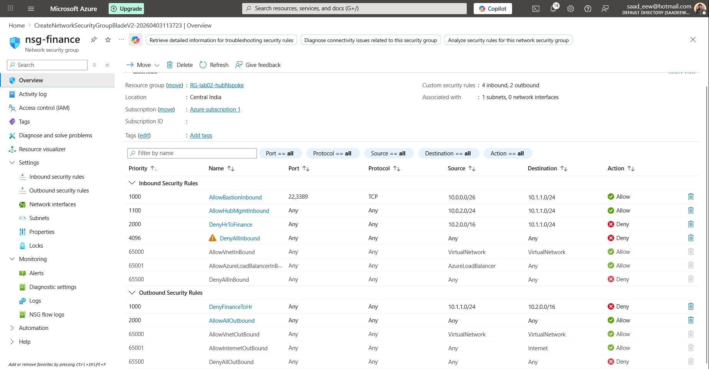

_nsg-finance: AllowBastionInbound (TCP 22,3389 from 10.0.0.0/26), AllowHubMgmtInbound (from 10.0.2.0/24), DenyHrToFinance (from 10.2.0.0/16, an explicit HR block), DenyAllInbound (4096). Outbound: DenyFinanceToHr (to 10.2.0.0/16), AllowAllOutbound. Associated with snet-finance._

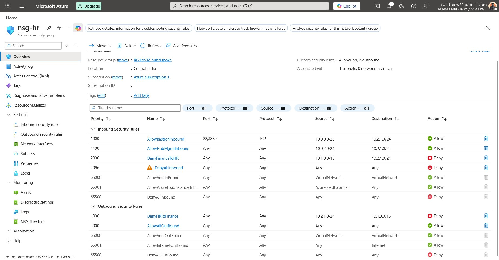

_nsg-hr: mirror image of nsg-finance with Finance and HR CIDRs reversed. DenyFinanceToHR at priority 2000 inbound, DenyHRToFinance at priority 1000 outbound. Associated with snet-hr._

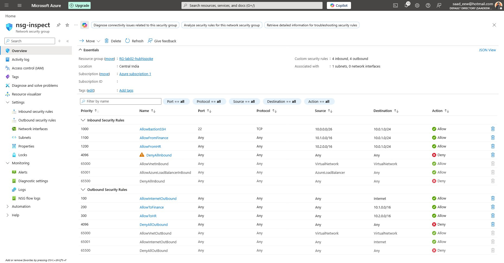

_nsg-inspect: inbound allows Bastion SSH and traffic from both spoke CIDRs, deny-all at 4096. Outbound: AllowInternetOutbound (destination Internet service tag) at priority 100, required for the NVA to forward spoke internet traffic onward._

---

### User-Defined Routes

Two route tables were created: one for Finance, one for HR. Each has a single custom route: 0.0.0.0/0 pointing to Virtual appliance at 10.0.1.4. This overrides Azure's default system route that sends internet traffic directly to the internet, replacing it with a path through vm-inspection.

This UDR also serves as the explicit outbound internet method required since Azure retired default outbound access for new VNets in March 2026. Without a UDR, NAT Gateway, public IP, or load balancer, spoke VMs in new VNets have no internet access at all.

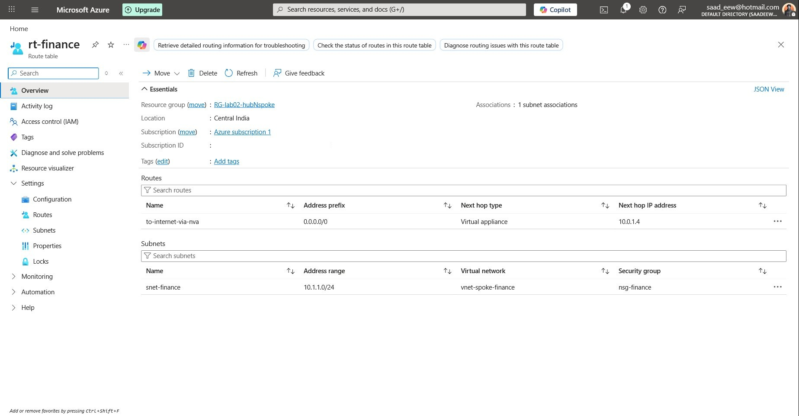

_rt-finance: to-internet-via-nva route, address prefix 0.0.0.0/0, next hop Virtual appliance 10.0.1.4. Associated subnets shows snet-finance in vnet-spoke-finance with nsg-finance attached._

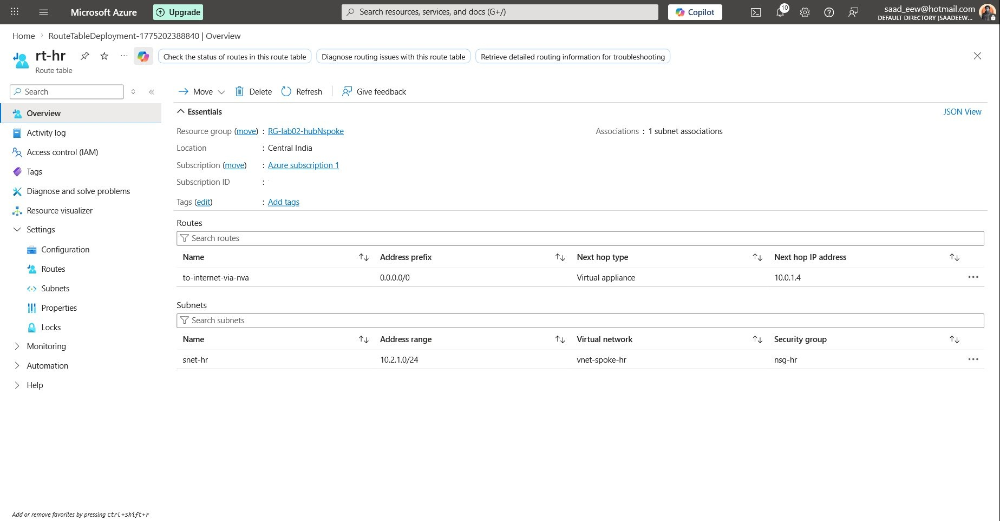

_rt-hr: identical route configuration. Associated with snet-hr in vnet-spoke-hr._

---

### Effective Routes

The Effective Routes blade is the ground truth for what routing is actually active on a VM's NIC. It shows every route Azure is applying (system defaults, peering routes, and UDRs) with their current state. This is the correct tool for verifying forced tunnelling, not just checking that a route table exists.

The key row is 0.0.0.0/0. The Default source entry for Internet shows State: Invalid; Azure's own system route has been overridden and is no longer active. The User source entry for Virtual appliance shows State: Active, confirming the UDR is in effect and all internet-bound traffic from this VM goes through vm-inspection.

_vm-finance8 NIC effective routes: Default 0.0.0.0/0 → Internet = Invalid (overridden). User 0.0.0.0/0 → Virtual appliance 10.0.1.4, route name to-internet-via-nva = Active. Associated route table: rt-finance._

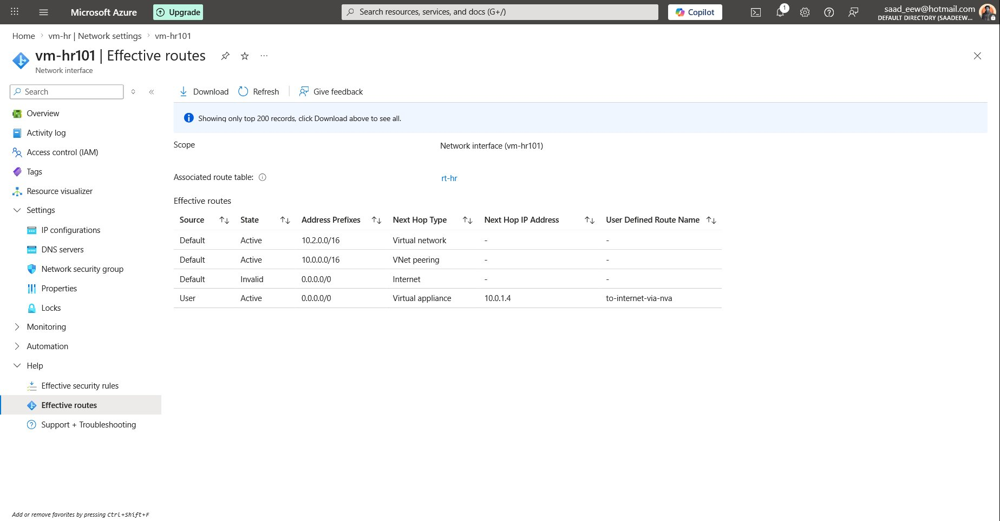

_vm-hr101 NIC effective routes: identical pattern: Default internet route Invalid, User Virtual appliance route Active. Associated route table: rt-hr._

---

### Centralised Monitoring

The Log Analytics workspace in vnet-hub represents the IT shared services that both Finance and HR departments feed into. Both spoke VMs were onboarded using Azure Monitor Agent via a Data Collection Rule, not the Azure Diagnostics extension, which Microsoft deprecated and retired on March 31, 2026.

The DCR visualizer confirms the data pipeline: both VMs collect Windows Event Logs and send them to law-hubspoke. This demonstrates that hub shared services are reachable from both spokes without any spoke-to-spoke connectivity.

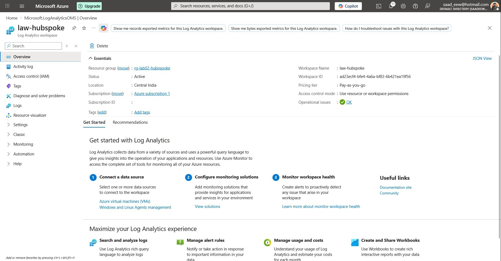

_law-hubspoke workspace overview: Status Active, Pay-as-you-go, Workspace ID visible, Central India: the hub's centralised logging service_

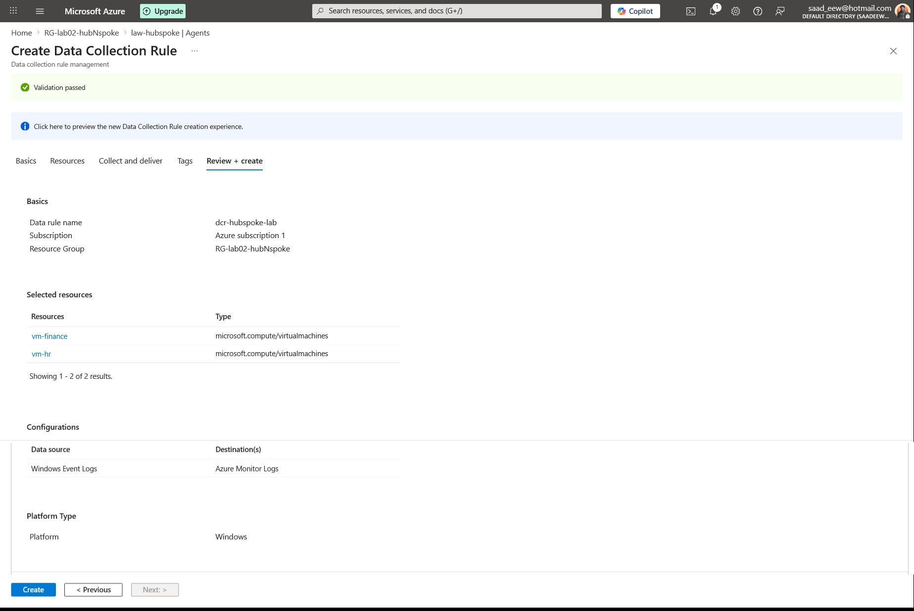

_Data Collection Rule review before creation: dcr-hubspoke-lab, vm-finance and vm-hr as resources, Windows Event Logs data source, Azure Monitor Logs destination_

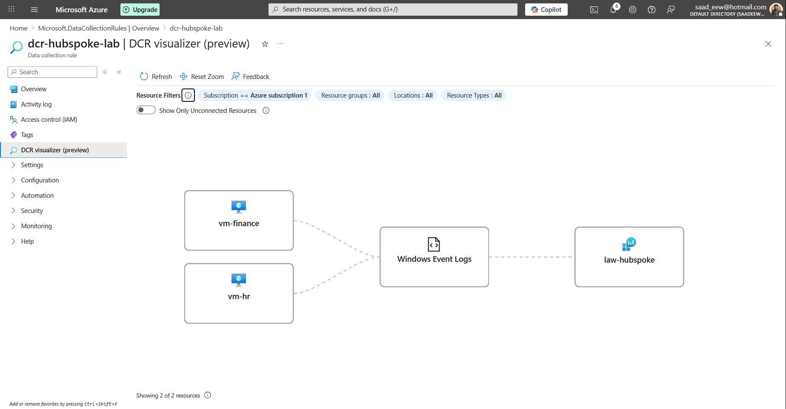

_DCR visualizer: vm-finance and vm-hr both flowing into Windows Event Logs data source, forwarding to law-hubspoke Log Analytics workspace_

---

### Verification

All security controls were verified using Azure Network Watcher rather than claimed. Three tools were used: Connection Troubleshoot for end-to-end path testing, IP Flow Verify for NSG rule identification, and Effective Routes for routing confirmation.

**Finance can reach hub shared services:**

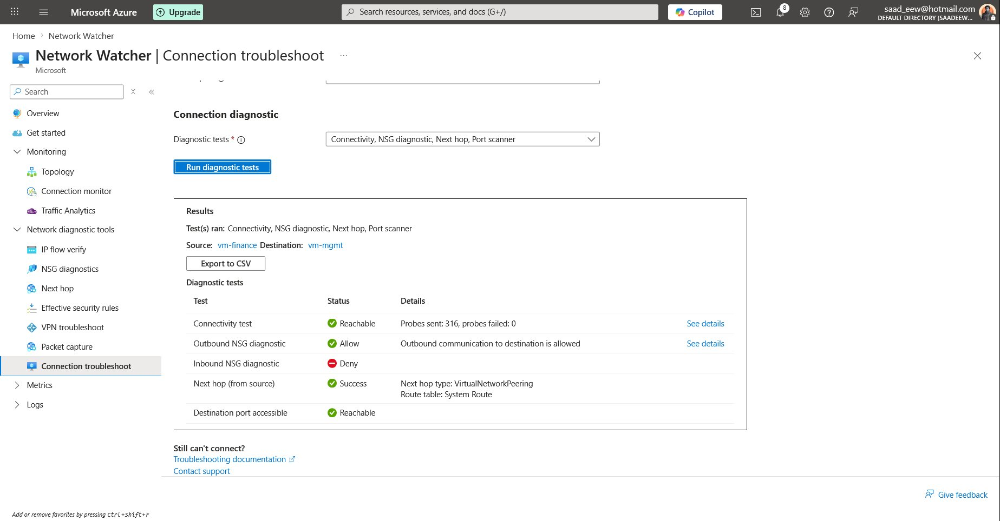

_Connection Troubleshoot: vm-finance → vm-mgmt. Connectivity: Reachable, 316 probes sent, 0 failed. Outbound NSG: Allow. Next hop: VirtualNetworkPeering via System Route. Destination port: Reachable._

**Finance cannot reach HR (both NSGs fire):**

This is the most important result in the lab. The Connection Troubleshoot output shows not just that the connection is blocked, but exactly which NSG rules are responsible. nsg-finance's outbound deny fires at the source and nsg-hr's inbound deny fires at the destination. Double enforcement. The Next hop also confirms the UDR is active: traffic is routing through Virtual Appliance at 10.0.1.4 via rt-finance, meaning even if both NSG deny rules were removed, traffic would still hit vm-inspection rather than reaching vm-hr directly.

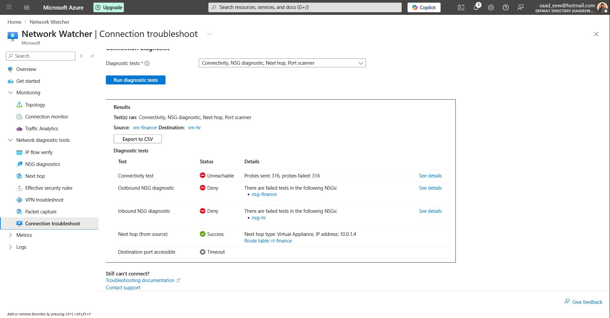

_Connection Troubleshoot: vm-finance → vm-hr. Connectivity: Unreachable, 316 probes failed. Outbound NSG: Deny (nsg-finance). Inbound NSG: Deny (nsg-hr). Next hop: Virtual Appliance 10.0.1.4, Route table: rt-finance._

**IP Flow Verify returns the exact rule name:**

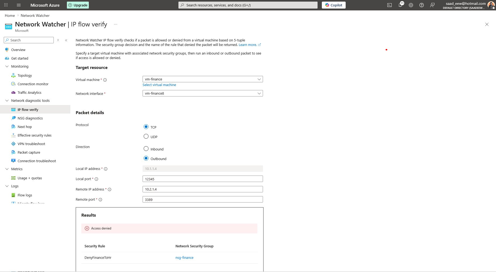

_IP Flow Verify: vm-finance outbound TCP to 10.2.1.4:3389. Result: Access denied. Security rule: DenyFinanceToHr. Network Security Group: nsg-finance._

---

## Design Decisions

<strong>Click to expand</strong>

 

**Why hub-spoke over a flat VNet topology?**

A flat topology where every VNet peers with every other VNet grows as O(n²): three VNets require three peerings, ten require 45, twenty require 190. Hub-spoke grows linearly. More importantly, a flat topology has no natural chokepoint for security inspection. Every VNet can reach every other VNet directly, which means a compromise in one spreads laterally to all others. Hub-spoke centralises security controls in the hub where they apply to all spokes without duplicating rules across every peering.

---

**Why is VNet peering non-transitive and why does that matter here?**

When Finance peers with hub and HR peers with hub, Finance and HR cannot reach each other through the hub. Azure does not pass traffic through a VNet acting as an intermediary by default. This is a deliberate design decision by Azure, not a limitation. In this lab it is a security feature: spoke-to-spoke isolation is enforced at the network layer, meaning Finance and HR are isolated even before any NSG rules are evaluated. The NSG rules add a second layer on top of what the topology already provides.

---

**Why NSGs at the subnet level rather than NIC level?**

A subnet-level NSG applies to every VM in the subnet automatically. If a new VM is added to snet-finance it inherits nsg-finance immediately without any additional configuration. A NIC-level NSG must be attached manually to each VM, which creates a risk that a newly deployed VM is unprotected until someone remembers to attach the NSG. Subnet-level is the correct default for any consistent access control policy.

---

**Why are there explicit deny rules when Azure has a default DenyAll?**

Azure's default DenyAllInBound rule sits at priority 65500. The default AllowVnetInBound rule sits at priority 65000. AllowVnetInBound fires first and allows any VM in the VirtualNetwork service tag to reach any other VM, which in a peered environment includes VMs in other VNets. The explicit deny rules in nsg-finance and nsg-hr at priority 2000 sit above both defaults and block the specific CIDRs before the defaults are ever evaluated.

---

**Why does IP forwarding need to be enabled in two places?**

The Azure platform and the Linux kernel are independent systems. The Azure NIC setting controls whether the Azure SDN fabric will deliver a packet to the NIC when the destination IP is not the NIC's own address. The Linux kernel setting controls whether the OS will forward that packet to another interface or drop it. Enabling only the Azure setting means packets arrive at the NIC but are dropped by the kernel. Enabling only the kernel setting means packets never reach the NIC in the first place. Both must be set.

---

**Why use Network Watcher for verification rather than ping or traceroute?**

Ping uses ICMP, which is blocked by default NSGs. A failed ping does not distinguish between a routing issue, an NSG block, or the destination VM not responding to ICMP. Connection Troubleshoot uses TCP probes and inspects NSG rules, routing tables, and port reachability independently: it returns the specific NSG rule name that blocked traffic, which ping cannot. IP Flow Verify does the same for single packet analysis. These tools give deterministic, named results suitable for documentation. Ping gives a binary pass/fail with no explanation.

---

**Why Standard SKU for Azure Bastion rather than Basic?**

The Basic SKU does not support VNet peering connectivity. It can only reach VMs in the same VNet it is deployed in. The Standard SKU allows a single Bastion instance in the hub to connect to VMs across all peered spokes, which is the entire point of deploying it in the hub. Using Basic would require a Bastion in every spoke, multiplying cost and management overhead.

---

**Why Azure Monitor Agent over the Diagnostics extension?**

Microsoft deprecated the Azure Diagnostics extension and retired it on March 31, 2026 (the same day this lab was built). Azure Monitor Agent is the current replacement, uses Data Collection Rules for flexible targeting, and does not require a storage account. Using the deprecated extension would have meant building on a component with no future support path.

---

<strong>Troubleshooting</strong>

 

**Problem: vm-inspection not forwarding traffic despite IP forwarding enabled at NIC level**

After enabling IP forwarding on the Azure NIC and associating the UDR with the Finance subnet, Connection Troubleshoot still showed traffic timing out at vm-inspection rather than passing through.

Root cause: IP forwarding was enabled in the Azure portal (NIC level) but not at the Linux kernel level. The kernel was receiving the packets but dropping them silently because `net.ipv4.ip_forward` was 0.

Resolution: Connected to vm-inspection via Bastion and ran `sudo sysctl -w net.ipv4.ip_forward=1` to enable immediately, then `echo 'net.ipv4.ip_forward=1' | sudo tee -a /etc/sysctl.conf` to persist across reboots. Verification: `sysctl net.ipv4.ip_forward` returned 1.

**Learning:** NVA configuration always requires both the platform-level setting and the OS-level setting. The Azure portal provides no warning when only one is set.

---

**Problem: nsg-finance AllowBastionInbound rule not matching Bastion connections**

After setting Protocol to Any on the AllowBastionInbound rule, Bastion connections to vm-finance were working. However the rule was reviewed and corrected to TCP before final screenshots.

Root cause: Not a functional problem but a configuration quality issue. Bastion connects to VMs over TCP only: port 3389 for RDP and port 22 for SSH. Setting Protocol to Any unnecessarily permits UDP on those ports. It does not break anything but it widens the rule beyond what is required.

Resolution: Edited the rule to set Protocol to TCP. No connectivity impact.

**Learning:** NSG rules should be as specific as possible. Protocol: Any when only TCP is needed is unnecessary scope creep that will confuse anyone auditing the rules later.

---

**Problem: DenyAllInbound at priority 4096 triggers Azure portal warnings**

When saving the DenyAllInbound rule at priority 4096, Azure displayed two warnings: one about denying AzureLoadBalancer traffic and one about denying VirtualNetwork traffic.

Root cause: Azure warns on any explicit deny that blocks service tags it considers important for platform functionality. These are informational warnings, not errors, and do not prevent saving.

Resolution: Ignored both warnings and saved the rule. There is no load balancer in this lab, so the first warning is irrelevant. The second warning is intentional: VirtualNetwork-to-VirtualNetwork traffic being blocked is the entire point of the explicit deny rules above it.

**Learning:** Azure portal warnings on NSG rules are advisory. Evaluate each one against the intent of the rule rather than accepting or dismissing them automatically.

---

<strong>Cost</strong>

 

| Resource | Estimated Cost |
|---|---|
| vm-inspection (Standard DC1ds v3) | ~$0.12/hr when running |
| vm-finance (Standard DC1ds v3) | ~$0.166/hr when running |
| vm-hr (Standard DC1ds v3) | ~$0.166/hr when running |
| vm-mgmt (Standard DC1ds v3) | ~$0.166/hr when running |
| Azure Bastion (Standard SKU) | ~$0.19/hr when deployed |
| NAT Gateway (nat-cent) | ~$0.045/hr + data |
| Log Analytics Workspace | Pay-as-you-go, minimal ingestion |
| **Total active session cost** | **~$0.85/hr across all resources** |

All VMs were configured with auto-shutdown. Bastion was deleted after each working session and redeployed when needed; redeployment takes approximately 10 minutes. VMs were deallocated between sessions to stop compute billing while retaining disk configuration. The lab was completed across three sessions with a total active runtime of approximately 4 hours.

