# Lab 03: Storage Accounts and Data Management

## Business Scenario

MediCore Diagnostics is migrating their data platform to Azure. Their compliance team identified three distinct data categories, each carrying different regulatory and operational requirements. Patient documents contain protected health information and must never be publicly accessible, must be geo-redundant, and must be recoverable from accidental overwrites. Application logs are accessed frequently for the first 30 days then rarely touched, making them a cost optimization target. Compliance archives must be immutable for 7 years by regulation and cannot be modified or deleted by anyone, including administrators, for the duration of that period.

This lab designs and deploys a storage architecture in Azure that satisfies all three requirements simultaneously, with appropriate redundancy tiers, access controls, lifecycle automation, network isolation, and threat detection.

---

## Skills Demonstrated

|                    |                                                                                                                                                                                                                                                                                                                                                                                                                                                           |
| :----------------- | :-------------------------------------------------------------------------------------------------------------------------------------------------------------------------------------------------------------------------------------------------------------------------------------------------------------------------------------------------------------------------------------------------------------------------------------------------------- |
| **Blob Storage**   |                 |
| **Security**       |     |
| **Access Control** |                                                     |
| **Operations**     |                           |

---

## What Was Built

| Resource                  | Name                              | Details                                                |
| ------------------------- | --------------------------------- | ------------------------------------------------------ |
| Resource Group            | RG-lab03-storage                  | Central India                                          |
| Storage Account (Logs)    | stlogssur01sea                    | LRS, GPv2, Standard, Hot tier                          |
| Storage Account (Patient) | stpatientjdsea                    | RA-GRS, GPv2, Standard, Hot tier                       |
| Blob Container            | app-logs                          | Private access, lifecycle policy applied               |
| Blob Container            | patient-docs                      | Private access, versioning enabled                     |
| Blob Container            | compliance-archive                | Private access, WORM time-based retention              |
| File Share                | internal-docs                     | Transaction optimized, SMB, mounted as Z:              |
| Virtual Network           | vnet-lab03                        | 10.0.0.0/16, Central India                             |
| Subnet                    | snet-storage                      | 10.0.0.0/24, Microsoft.Storage service endpoint        |
| Private Endpoint          | pe-patient-docs                   | Blob sub-resource, 10.0.0.4, deleted post-verification |
| Private DNS Zone          | privatelink.blob.core.windows.net | Global, linked to vnet-lab03                           |
| Test User                 | analyst-lab03                     | Storage Blob Data Reader on patient account            |
| Log Analytics Workspace   | law-lab05                         | PerGB2018, diagnostic destination                      |

---

## Screenshots

### Storage Account Creation

Two storage accounts were created with deliberately different redundancy tiers to match the data they hold. The logs account uses LRS because application logs are regenerable from live systems — if the region fails, the new deployment will produce new logs going forward. The patient account uses RA-GRS because patient documents are irreplaceable PHI. No secondary source exists, so geo-redundancy is non-negotiable regardless of the cost difference.

Both accounts were hardened at creation: secure transfer enforced, anonymous blob access disabled, TLS 1.2 minimum, infrastructure encryption enabled (which can only be set at creation time and cannot be toggled afterward), and permitted scope for copy operations restricted to the same Azure AD tenant.

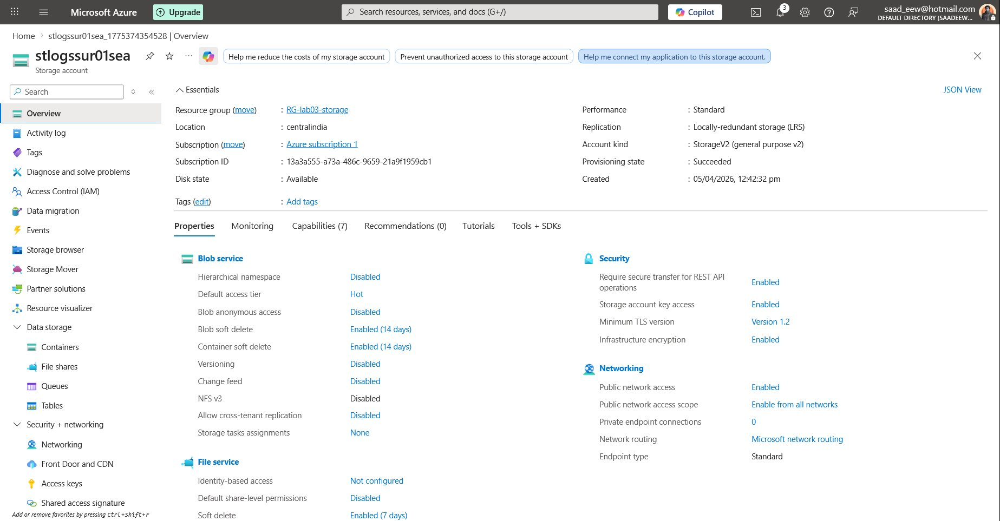

_stlogssur01sea overview: Locally-redundant storage (LRS), Central India, StorageV2 general purpose v2, infrastructure encryption Enabled, storage account key access Enabled, TLS 1.2_

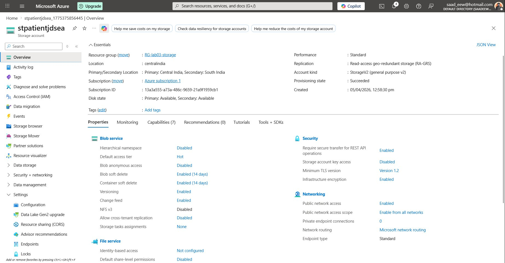

_stpatientjdsea overview: Read-access geo-redundant storage (RA-GRS), Primary: Central India, Secondary: South India — storage account key access Disabled, versioning Enabled, change feed Enabled, infrastructure encryption Enabled_

The security baseline on the logs account was verified through the Configuration blade. Key access remains enabled here because this account holds regenerable log data and the file share mount script requires it. The critical hardening — key access disabled — is applied only to the patient account where PHI lives, where the audit trail requirement is non-negotiable.

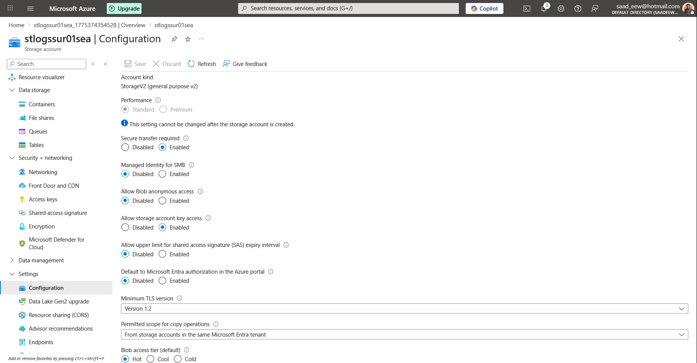

_stlogssur01sea Configuration blade: secure transfer Enabled, blob anonymous access Disabled, key access Enabled, TLS 1.2, permitted scope for copy operations set to same Microsoft Entra tenant_

---

### Blob Containers and Test Data

Three containers were created across the two accounts, all set to Private access. The compliance-archive and patient-docs containers live in the RA-GRS patient account. Compliance records are legally sensitive and require the same geo-redundancy as patient documents — losing the compliance chain in a regional failure would break the regulatory audit trail.

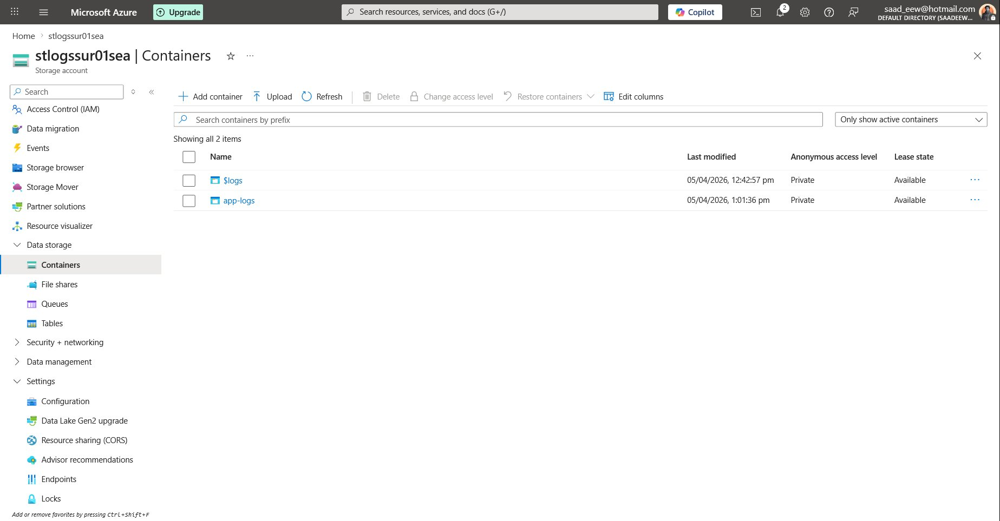

_stlogssur01sea Containers: app-logs with Private anonymous access level alongside the system $logs container_

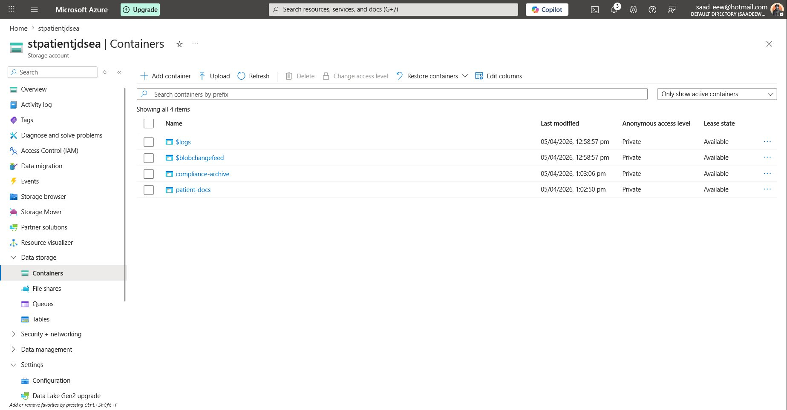

_stpatientjdsea Containers: compliance-archive and patient-docs both showing Private access — the system $logs and $blobchangefeed containers were auto-created by Azure when versioning and change feed were enabled at account creation_

Test data was uploaded to each container to verify access controls and to generate operations for the diagnostic log pipeline. The authentication method differs between accounts: the logs account uses Access key (keys are enabled), while the patient account uses Microsoft Entra user account throughout because keys are disabled and Entra ID is the only permitted authentication path.

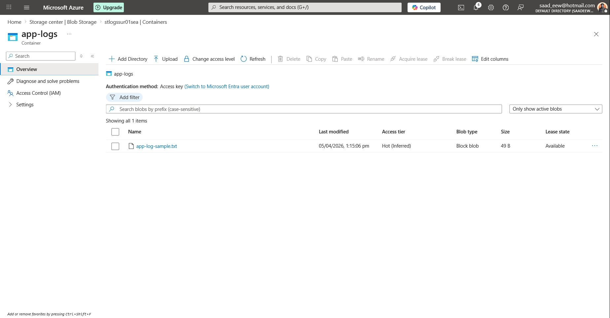

_app-logs container: app-log-sample.txt uploaded, 49 B, Hot (Inferred), Block blob — authentication via Access key_

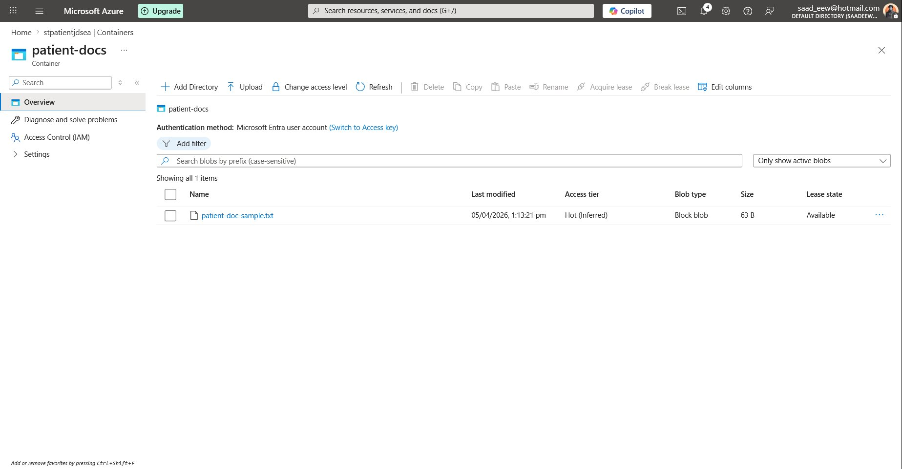

_patient-docs container: patient-doc-sample.txt uploaded, 63 B, Hot (Inferred), Block blob — authentication via Microsoft Entra user account_

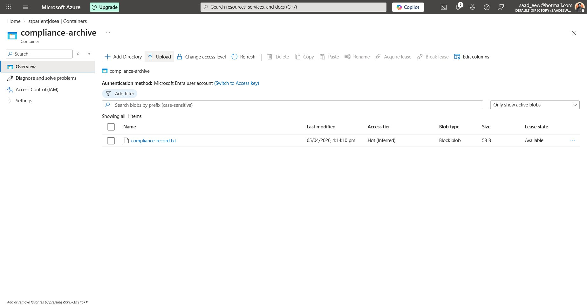

_compliance-archive container: compliance-record.txt uploaded, 58 B, Hot (Inferred), Block blob — authentication via Microsoft Entra user account_

---

### Lifecycle Management Policy

The logs account receives a lifecycle policy that automatically moves blobs through Hot, Cool, and Archive tiers based on last access time. Without this, log data accumulates indefinitely in Hot storage at three to twelve times the cost of Archive. The policy enforces cost governance at the infrastructure level, removing the human step that never happens under operational pressure.

Last access time tracking must be explicitly enabled before creating rules that use the `daysAfterLastAccessTimeGreaterThan` condition. The portal does not enforce this automatically. Without it, Azure has no `LastAccessTime` property to evaluate and falls back to the date tracking was enabled, producing incorrect tiering behavior for any blobs that predate that point.

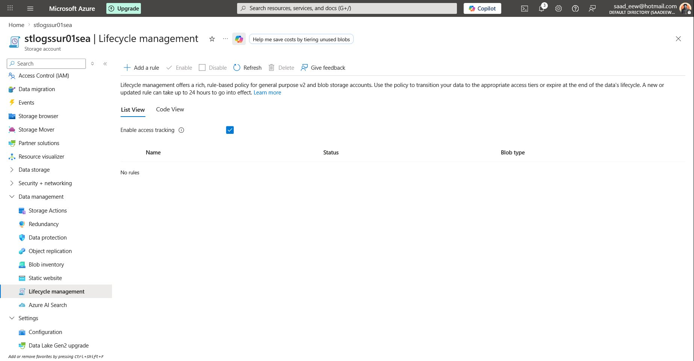

_stlogssur01sea Lifecycle management: Enable access tracking checkbox checked before any rules are created — a required prerequisite for last-access-time-based tiering conditions_

The policy JSON confirms both rules are defined correctly. The logs-to-archive rule includes both `daysAfterLastAccessTimeGreaterThan: 90` and `daysAfterLastTierChangeGreaterThan: 7` — the second condition prevents blobs that were just tiered to Cool from immediately qualifying for Archive before the tier change has had time to settle.

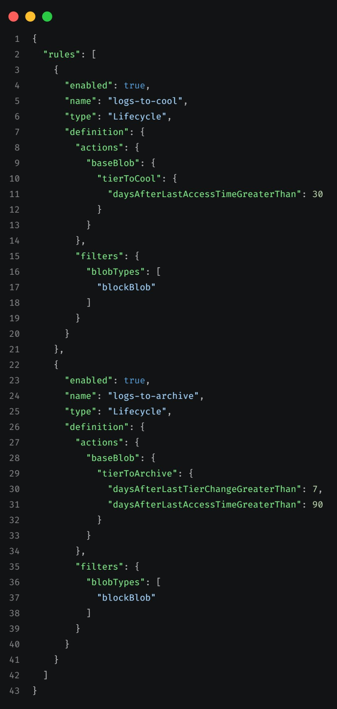

_Lifecycle management Code View: logs-to-cool rule (tierToCool at 30 days last access) and logs-to-archive rule (tierToArchive at 90 days last access with 7-day tier change guard) both enabled for blockBlob type_

---

### WORM Immutability Policy

The compliance-archive container has a time-based WORM (Write Once, Read Many) retention policy enforcing immutability at the storage platform level. No user, no administrator, and no compromised account can delete or modify these records during the retention period. In production this would be 2555 days (7 years). In this lab it is set to 1 day to allow cleanup after verification.

The policy is left in the Unlocked state for the lab. Locking is irreversible: once locked, the retention period can only be extended never reduced, the policy cannot be deleted, and the container cannot be deleted until all blobs inside have expired. In production the policy would be locked immediately after creation to satisfy regulatory requirements including SEC 17a-4(f).

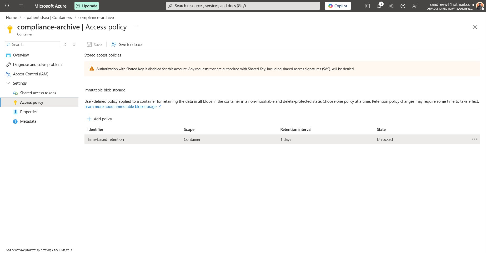

_compliance-archive Access policy blade: Time-based retention, Scope: Container, Retention interval: 1 days, State: Unlocked_

The policy was tested by selecting compliance-record.txt in the container and clicking Delete. The portal returned an immediate error at the storage layer — this is not an RBAC denial or a network block, it is the storage platform itself rejecting the operation because the blob is in an immutable state.

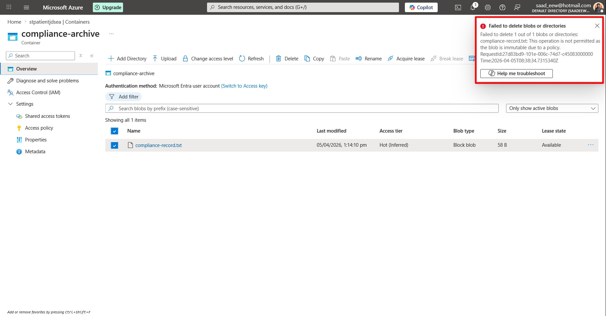

_compliance-archive container: delete attempt on compliance-record.txt rejected with "This operation is not permitted as the blob is immutable due to a policy" — the blob remains listed and untouched_

---

### SAS Token — Scoped Delegated Access

An external auditor requires quarterly read-only access to the patient-docs container. The SAS was generated from the container's Shared access tokens blade, not the account-level Shared access signature blade. The account-level path attempts to sign with the account key, which is disabled and will fail. The container-level path uses the signed-in Entra ID identity automatically, producing a User Delegation SAS.

The warning banner visible at the top of the blade confirms key-based authorization is disabled — this is what forces the signing method to User delegation key, which is exactly the correct outcome. Permissions were restricted to Read and List only, with HTTPS-only protocol enforced and a 75-minute expiry window.

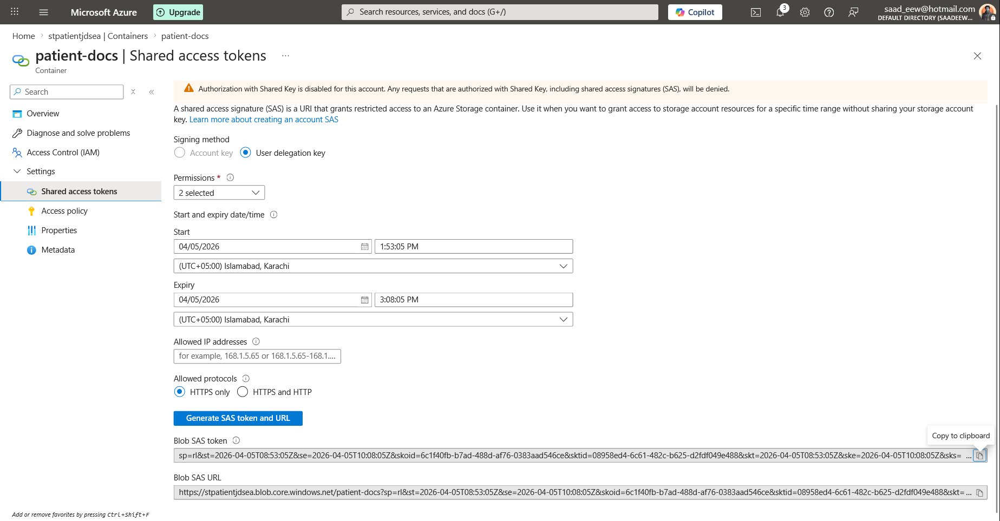

_patient-docs Shared access tokens: Signing method forced to User delegation key (Account key greyed out), 2 permissions selected (Read + List), HTTPS only, 75-minute expiry — Blob SAS token and URL generated at bottom_

The SAS URL was tested by pasting it into a browser with `&restype=container&comp=list` appended, calling the Azure Blob Storage REST API directly. The response is an XML document listing the blobs inside the container with no login, no account key, and no additional credentials involved. The `ServerEncrypted: true` field on every blob confirms encryption at rest is active across the account.

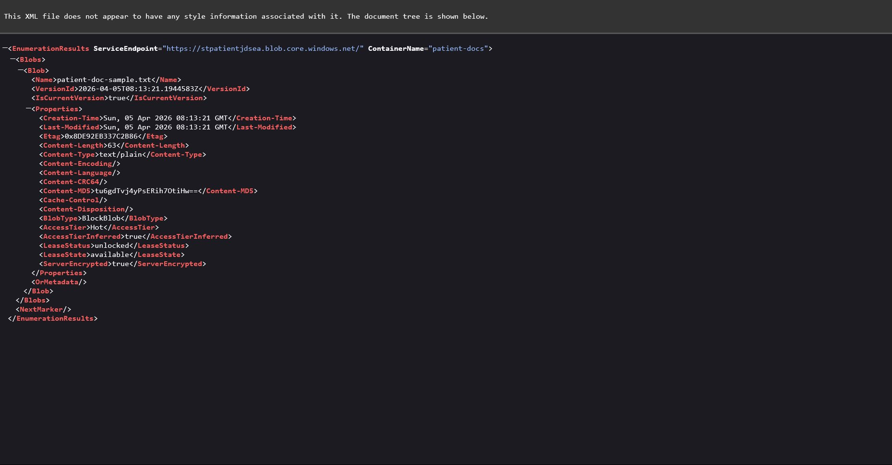

_Browser response to SAS URL with list parameters: XML EnumerationResults for patient-docs showing patient-doc-sample.txt with ServerEncrypted: true, BlobType: BlockBlob, AccessTier: Hot — read access confirmed with scoped token only_

---

### RBAC — Storage Blob Data Reader

A junior data analyst requires ongoing read access to the patient-docs container. A SAS token is the wrong tool here because this is an internal Entra ID user — their access should be managed through identity so it can be audited, modified, and revoked centrally without affecting other users.

The role assigned is `Storage Blob Data Reader`, not `Reader`. The built-in Reader role grants control-plane access: you can see the storage account exists in the portal and read its configuration. It does not grant permission to read a single byte of blob data. Storage Blob Data Reader grants data-plane access, which is a completely separate permission system in Azure. Assigning Reader and wondering why the user cannot download files is one of the most common Azure storage access mistakes in practice and one of the most reliable interview questions on storage RBAC.

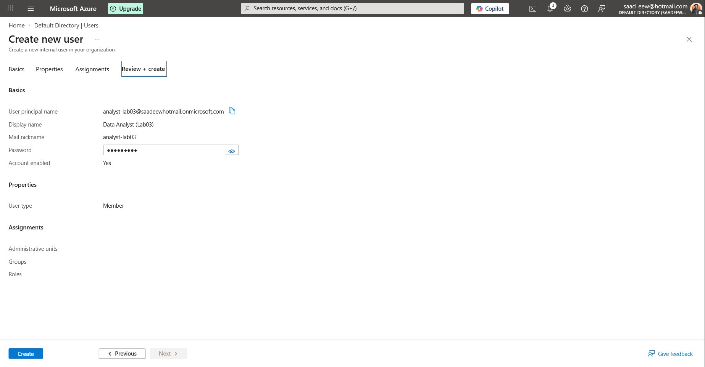

_Entra ID Create new user Review + create: UPN analyst-lab03@saadeewhotmail.onmicrosoft.com, Display name Data Analyst (Lab03), User type Member, Account enabled Yes_

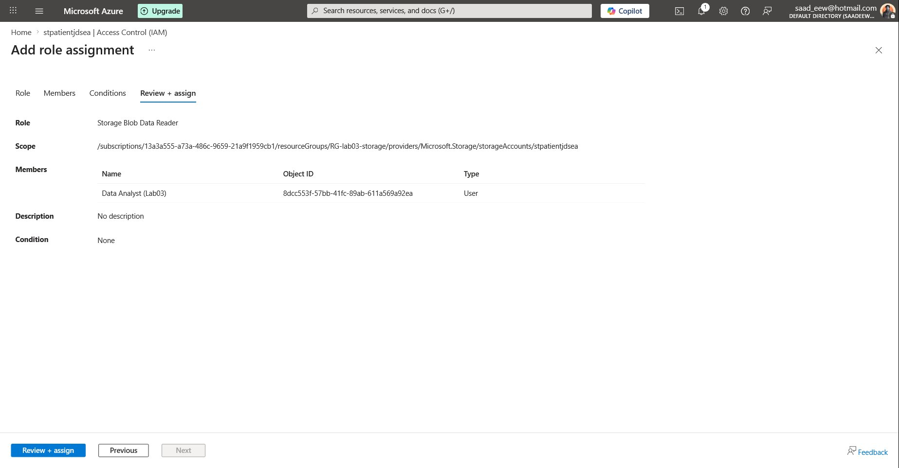

_Add role assignment Review + assign: Role Storage Blob Data Reader, Scope scoped to stpatientjdsea storage account ARM path, Member Data Analyst (Lab03) as User type_

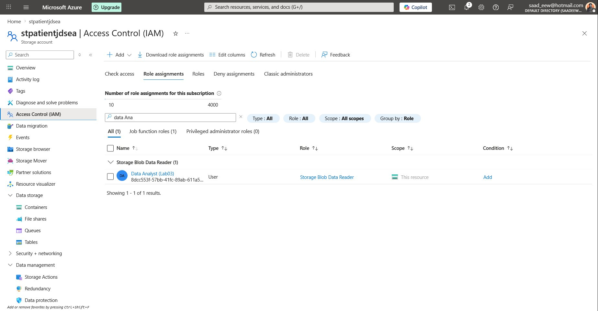

_stpatientjdsea IAM Role assignments filtered by "data Ana": Data Analyst (Lab03) assigned Storage Blob Data Reader at This resource scope — 1 of 1 results_

---

### Azure File Share

The internal IT team requires a shared drive for non-patient internal documents. These do not contain PHI so they live in the LRS logs account. The share uses Transaction optimized tier, which is optimal for the frequent small reads and writes of team members opening and saving documents. The share was connected to a Windows machine using the portal-generated mount script, mapping it as network drive Z:.

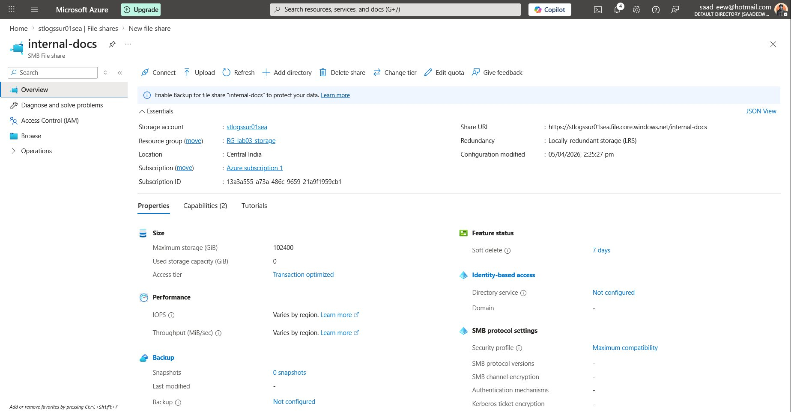

_internal-docs SMB file share overview: storage account stlogssur01sea, Central India, LRS, Share URL visible, Access tier Transaction optimized, soft delete 7 days_

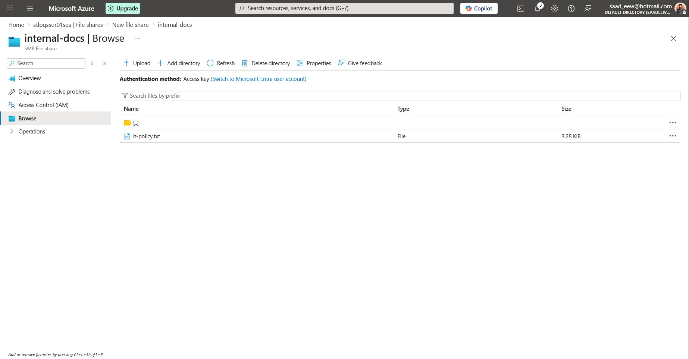

_internal-docs Browse view: IT-Policies directory with it-policy.txt uploaded, 3.28 KiB, authentication via Access key_

The share was successfully mounted as a Windows network drive, proving the SMB connection works end to end. The UNC path `\\stlogssur01sea.file.core.windows.net\internal-docs` appears in Windows Explorer under Network locations alongside the local disks, and files inside the share are accessible directly from File Explorer without any additional tools.

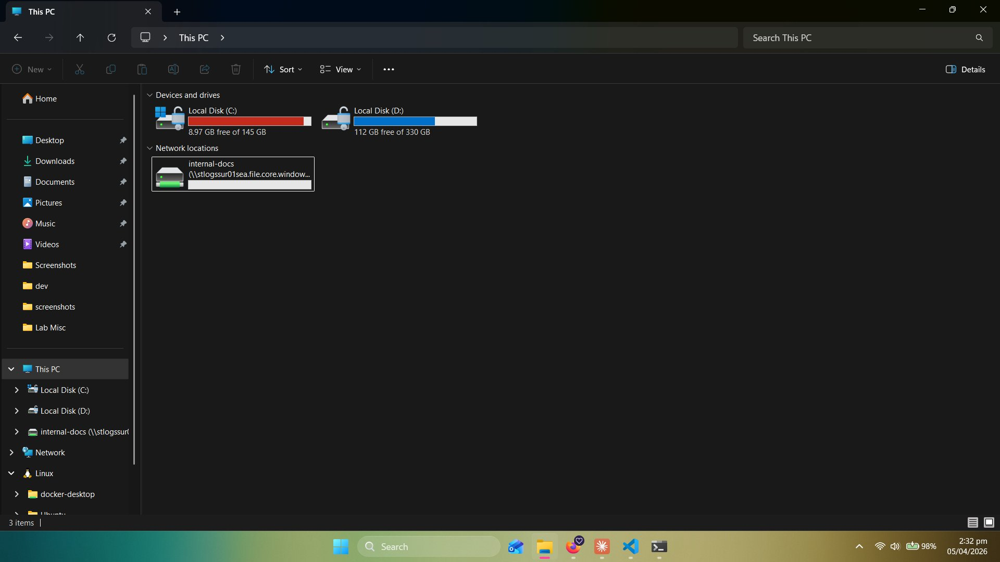

_Windows This PC: internal-docs mounted as network drive (\\stlogssur01sea.file.core.windows.net) visible under Network locations_

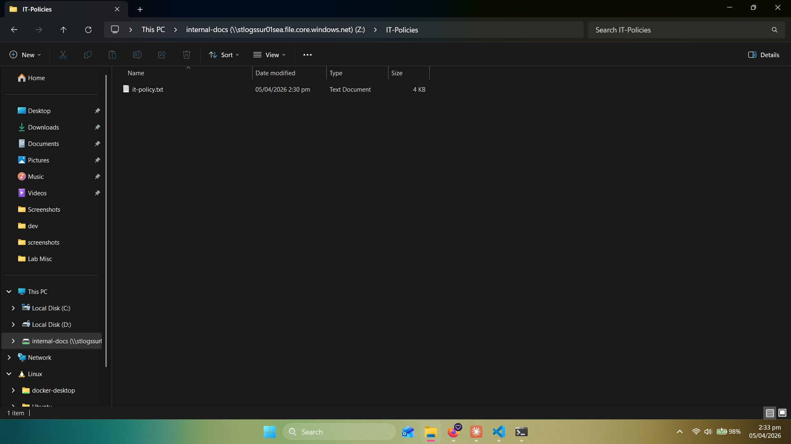

_Windows File Explorer: IT-Policies folder inside the mounted share showing it-policy.txt (4 KB) — the full UNC path is visible in the address bar confirming the SMB connection to Azure Files_

---

### VNet and Storage Firewall

Lab 01 resources were deleted before this lab began, so a dedicated VNet was created to support the storage firewall rule and the private endpoint. The VNet contains a single subnet with the Microsoft.Storage service endpoint enabled, which routes traffic from that subnet directly to Azure Storage over Microsoft's backbone network rather than the public internet.

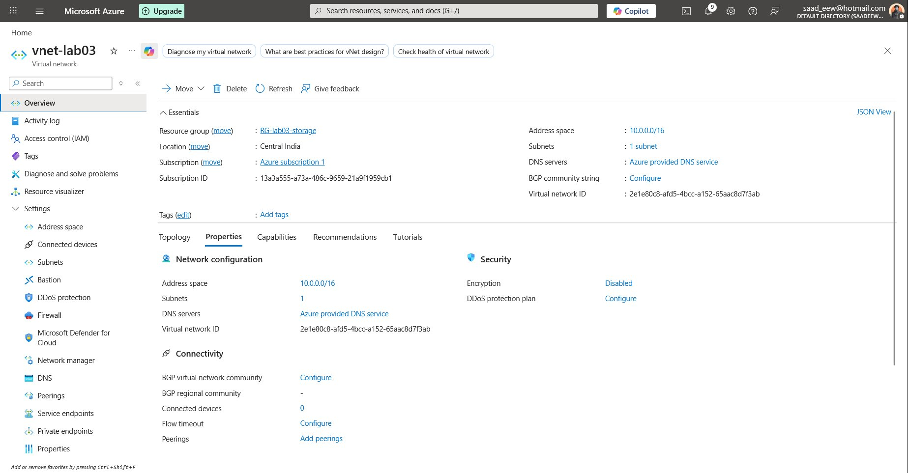

_vnet-lab03 overview: RG-lab03-storage, Central India, address space 10.0.0.0/16, 1 subnet (snet-storage), Azure provided DNS service_

Both storage accounts were then restricted to accept connections only from vnet-lab03/snet-storage and the current client IP. The Endpoint Status column confirms the Microsoft.Storage service endpoint is active and Enabled on the subnet before the firewall rule takes effect.

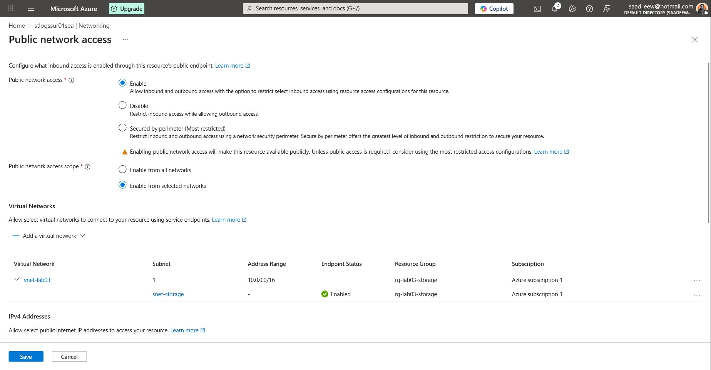

_stlogssur01sea Networking blade: Public network access set to Enable from selected networks, vnet-lab03 listed with snet-storage subnet, Endpoint Status: Enabled (green checkmark)_

---

### Private Endpoint

The storage firewall restricts who can reach the public endpoint, but the public endpoint still exists. A private endpoint goes further by assigning the storage account a private IP address inside the VNet and removing the public surface entirely. Even with valid credentials, a client on the public internet cannot reach the account because there is no public route to it.

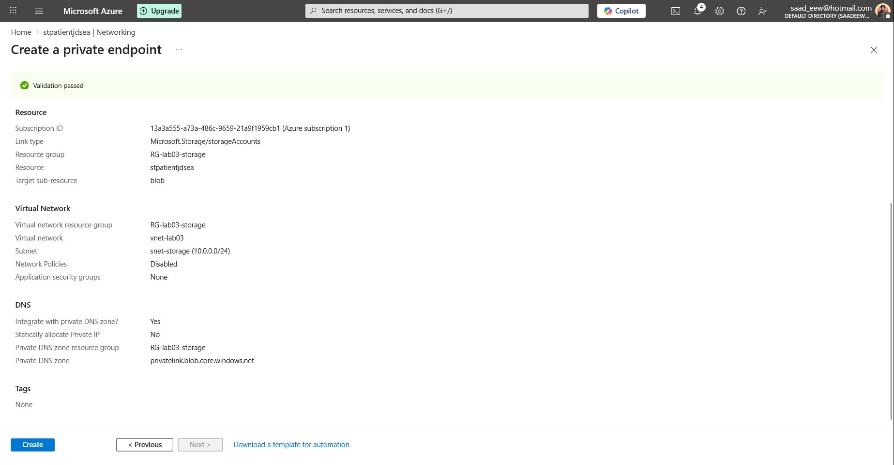

_Create private endpoint Review + Create: Validation passed, resource stpatientjdsea, target sub-resource blob, VNet vnet-lab03, subnet snet-storage (10.0.0.0/24), integrate with private DNS zone Yes, privatelink.blob.core.windows.net_

After deployment, the private endpoint overview confirmed the connection was Auto-Approved and the link resource is stpatientjdsea with blob as the target sub-resource.

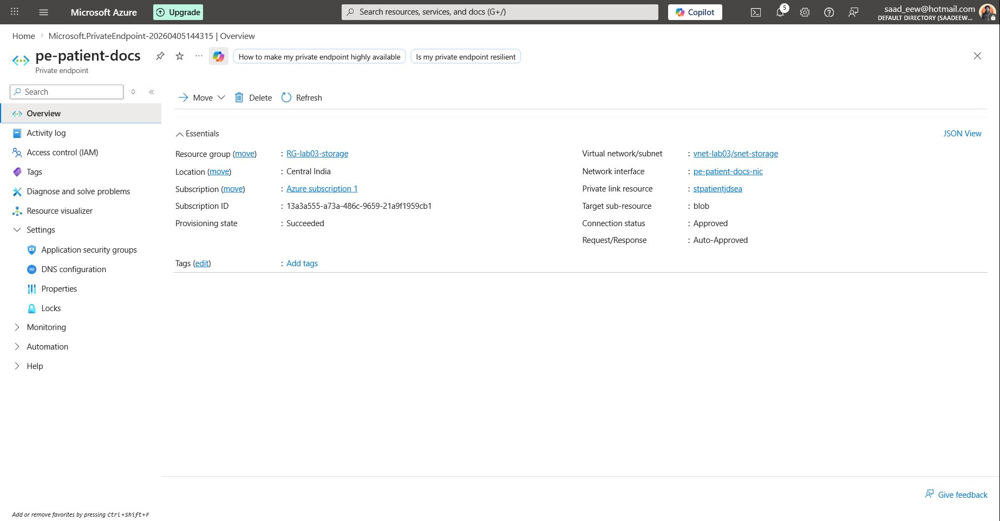

_pe-patient-docs overview: RG-lab03-storage, Central India, VNet/subnet vnet-lab03/snet-storage, Private link resource: stpatientjdsea, Target sub-resource: blob, Connection status: Approved_

The DNS configuration confirms the key outcome of the private endpoint: `stpatientjdsea.blob.core.windows.net` now resolves to `10.0.0.4`, a private IP inside the VNet address range. Any resource inside vnet-lab03 calling this FQDN gets the private IP, and traffic never leaves Microsoft's internal network. Resources outside the VNet cannot reach this endpoint at all.

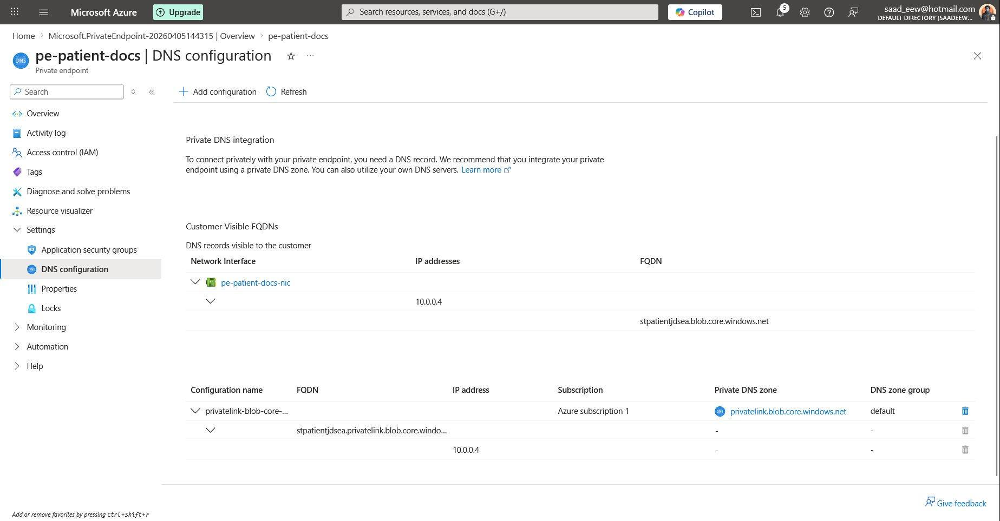

_pe-patient-docs DNS configuration: Network interface pe-patient-docs-nic mapped to IP 10.0.0.4 — FQDN stpatientjdsea.blob.core.windows.net resolves to private IP, private DNS zone privatelink.blob.core.windows.net integrated_

---

### Microsoft Defender for Storage

Defender for Storage adds anomaly-based threat detection on top of the network and access controls. It analyzes blob operations for patterns that indicate compromise: malicious access attempts, sensitive data exfiltration, and suspicious activity patterns. This is the storage equivalent of an IDS — it does not prevent misconfiguration but detects malicious activity against a correctly configured account.

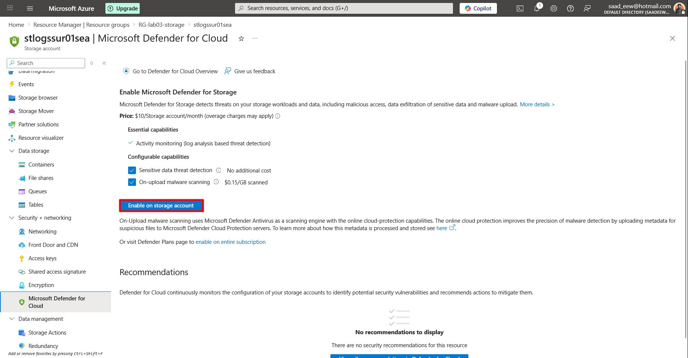

_stlogssur01sea Microsoft Defender for Cloud: Enable page showing $10/account/month pricing, essential capability (Activity monitoring) and configurable capabilities (Sensitive data threat detection, On-upload malware scanning at $0.15/GB) before clicking Enable_

_stlogssur01sea Microsoft Defender for Cloud: Status On, activity monitoring and sensitive data threat detection active — on-upload malware scanning not enabled, likely due to free trial subscription restrictions_

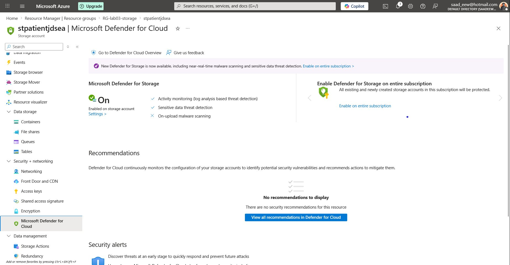

_stpatientjdsea Microsoft Defender for Cloud: Status On, activity monitoring and sensitive data threat detection active — on-upload malware scanning not enabled, likely due to free trial subscription restrictions_

---

### Diagnostic Logging and KQL

Diagnostic settings route every blob operation to a Log Analytics workspace. This creates a queryable audit trail that satisfies the HIPAA requirement for access logging on systems containing PHI. Every read, write, delete, and authentication event is recorded with timestamps, operation types, HTTP status codes, caller IP addresses, and the full blob URI.

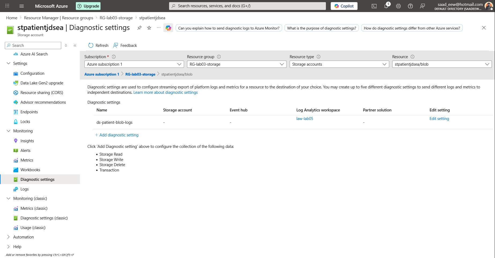

_stpatientjdsea Diagnostic settings: ds-patient-blob-logs setting configured for the blob sub-resource, destination law-lab05 Log Analytics workspace — captures Storage Read, Write, Delete, and Transaction metrics_

After performing blob operations and waiting for ingestion, the workspace returned 6 results confirming the pipeline works end to end. The results show both PutBlob operations (status 201, from the Azure internal IP used by the portal) and a DeleteBlob attempt (status 202, from an external IP hitting patient-docs directly), giving a real mixed view of read and write audit events.

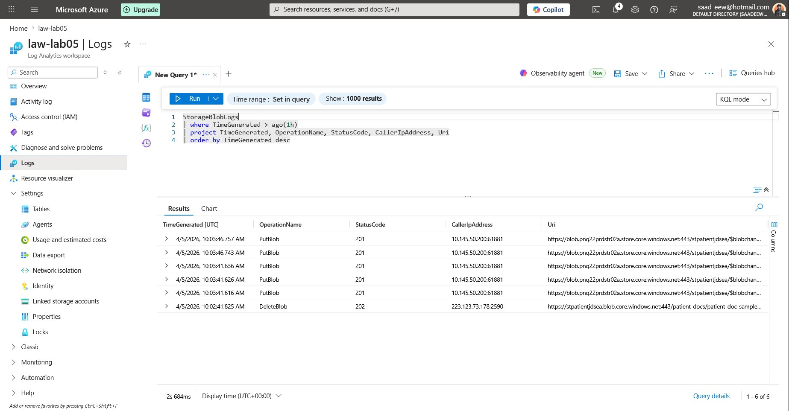

_law-lab05 Log Analytics KQL query: StorageBlobLogs returning 6 results — 5 PutBlob operations at status 201 from 10.145.50.200, 1 DeleteBlob at status 202 from external IP 223.123.73.178 targeting patient-docs/patient-doc-sample_

---

### Resource Group Overview

With all components deployed, the resource group gives a complete picture of everything built. The private endpoint resource itself was accidentally deleted during the lab but the Private DNS zone (`privatelink.blob.core.windows.net`) remains, as does all other infrastructure.

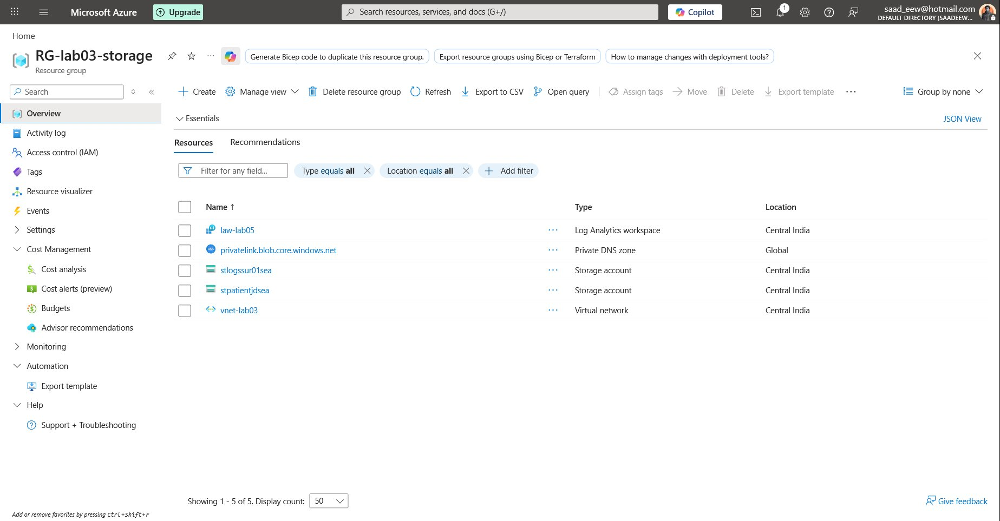

_RG-lab03-storage: 5 resources — law-lab05 (Log Analytics workspace), privatelink.blob.core.windows.net (Private DNS zone), stlogssur01sea (Storage account), stpatientjdsea (Storage account), vnet-lab03 (Virtual network) — all in Central India except the DNS zone which is Global_

---

<strong>Key Decisions</strong>

 

**Why GRS for patient documents but LRS for application logs?**

Patient documents are irreplaceable. If a regional failure destroys the primary datacenter, those records cannot be reconstructed from any other source. GRS asynchronously replicates a second copy to a paired region hundreds of kilometers away. Application logs are generated continuously by live systems. If a region fails, the new deployment will generate new logs going forward. The historical loss is operationally acceptable. GRS costs approximately twice LRS. Applying it only where data is truly irreplaceable is sound financial governance.

---

**Why RA-GRS over standard GRS on the patient account?**

Standard GRS only makes the secondary region readable after Microsoft formally declares a regional failover, a process that can take hours. Read-access GRS makes the secondary endpoint readable at all times. During a partial outage where the primary is degraded but not failed, RA-GRS allows read operations to continue from the secondary immediately without waiting for Microsoft's failover declaration. For a healthcare environment where patient record access cannot be blocked for hours, this is the correct choice.

---

**Why disable storage account keys on the patient account?**

Storage account keys are binary: you either have unrestricted full-account access or you have none. They cannot be scoped to a single container or operation type. They cannot be subject to MFA or Conditional Access. When they leak, and at scale they eventually do, there is no audit trail of what was accessed before discovery. Disabling keys forces all access through Entra ID, which provides least-privilege RBAC scoping, MFA enforcement, and a complete audit log of every data-plane operation queryable in Log Analytics.

---

**Why a User Delegation SAS instead of an Account SAS?**

An Account SAS is signed with the storage account key, which is disabled on this account. A User Delegation SAS is signed with the generating user's Entra ID OAuth token, meaning it inherits that identity's Conditional Access policies and appears in audit logs tied to a real identity rather than an anonymous key. If the token is leaked, all outstanding User Delegation SAS tokens can be revoked by rotating the delegation key without touching account credentials.

---

**Why Storage Blob Data Reader and not Reader?**

The built-in Reader role grants control-plane access: the ability to see the storage account in the portal and read its configuration. It does not grant permission to read blob data. Storage Blob Data Reader grants data-plane access, which is a separate permission system in Azure. These are two distinct authorization layers and conflating them is one of the most reliable interview questions on Azure storage RBAC.

---

**Why configure lifecycle policies based on last access time?**

Tiering based on last modified time is less accurate for log data because logs are written once and then read repeatedly. A log written 90 days ago but read yesterday should stay in Cool, not move to Archive. Last access time tracking captures actual read behavior, making the tiering decision reflect real usage patterns rather than just when the file was created.

---

**Why a private endpoint rather than just a storage firewall?**

A storage firewall restricts which networks can reach the public endpoint, but the public endpoint still exists. DNS still resolves to a public IP. A private endpoint eliminates the public surface entirely. DNS resolves to a private IP inside the VNet. Traffic never leaves Microsoft's internal network. Even with valid credentials, a client on the public internet has no route to the account. The difference is between restricting access and eliminating the attack surface — a meaningful distinction in a PHI environment.

---

**Why enable infrastructure encryption?**

Azure Storage encrypts all data at the service level by default using AES-256. Infrastructure encryption adds a second independent layer at the hardware level using a separate key and algorithm. If one encryption layer is somehow compromised, the other remains intact. This setting must be enabled at account creation time and cannot be changed afterward.

---

<strong>Troubleshooting</strong>

 

**Problem: WORM policy creation failed with a conflict error**

After creating the compliance-archive container and attempting to add a time-based WORM retention policy, the portal returned: `Failed to update retention policy for container 'compliance-archive'. Error: Conflicting feature 'Point-in-Time Restore' is enabled. Please disable it and retry.`

Root cause: Point-in-time restore and container-level WORM policies are architecturally incompatible. PITR works by maintaining a continuous change log of all blob operations to enable rollback. WORM prohibits modification of that very change history. Azure enforces this at the API level and will not allow both simultaneously on the same account.

Resolution: Navigated to stpatientjdsea Data management > Data protection and disabled point-in-time restore. The WORM policy was then applied successfully. Versioning and soft delete remain enabled, which serve as the recovery mechanism for the patient-docs container against accidental overwrites and deletions.

Production note: The architecturally correct solution is three storage accounts rather than two — logs (LRS), patient documents (RA-GRS with PITR), and compliance archives (RA-GRS with WORM, PITR disabled). Separating them eliminates the conflict entirely and allows each account to be configured optimally for its data class.

**Learning:** Point-in-time restore and WORM immutability are mutually exclusive on the same storage account. When both are needed, the data must be separated into dedicated accounts.

---

**Problem: Private endpoint accidentally deleted before taking the connection screenshot**

The pe-patient-docs private endpoint was accidentally deleted from the portal before the stpatientjdsea Private endpoint connections tab screenshot could be taken. The DNS configuration and overview screenshots were captured before deletion, but the resource group overview shows only the Private DNS zone (privatelink.blob.core.windows.net) remaining rather than the endpoint itself.

Resolution: The DNS configuration screenshot (10.0.0.4 mapped to stpatientjdsea.blob.core.windows.net) and the private endpoint overview screenshot (Connection status: Approved) were both captured successfully before deletion and serve as the documentation of the configuration. The private DNS zone persisting in the resource group confirms the integration was completed.

**Learning:** Take all required screenshots immediately after a resource is deployed before performing any other actions. Deletion is irreversible and recreating a private endpoint for documentation purposes adds unnecessary cost.

---

**Problem: "Allow cross-tenant replication" setting not found in the portal**

The expected "Allow cross-tenant replication" toggle did not appear in the Advanced tab during storage account creation.

Root cause: Microsoft renamed and restructured this control. It is now called "Permitted scope for copy operations" and appears as a dropdown in both the Advanced tab during creation and in the Configuration blade post-creation. The options are "From any storage account" (the insecure default) and "From storage accounts in the same Azure AD tenant."

Resolution: Set "Permitted scope for copy operations" to "From storage accounts in the same Microsoft Entra tenant" on both accounts via the Configuration blade.

**Learning:** Azure portal UI changes faster than most documentation. When a setting cannot be found, look for a renamed or restructured equivalent.

---

**Problem: Log Analytics workspace accidentally named law-lab05 instead of law-lab03**

During workspace creation the name `law-lab05` was entered instead of `law-lab03`. The workspace was already deployed and receiving diagnostic logs before the mistake was noticed.

Resolution: The workspace was left as `law-lab05` rather than deleted and recreated, since renaming would have required updating the diagnostic settings on the storage account and re-waiting for log ingestion. All references in this README use the actual deployed name `law-lab05`.

**Learning:** Verify resource names on the Review + create screen before deploying. Renaming Azure resources post-deployment is generally not possible — the resource must be deleted and recreated.

---

**Problem: On-upload malware scanning could not be enabled on either storage account**

When enabling Microsoft Defender for Storage, the on-upload malware scanning capability showed as inactive (X) on both accounts despite being selected on the enable page. The feature requires additional configuration that did not complete.

Root cause: Likely a free trial subscription restriction. On-upload malware scanning costs $0.15 per GB scanned and may require a paid subscription tier or specific policy permissions to activate. The exact error was not surfaced clearly by the portal.

Resolution: Activity monitoring and sensitive data threat detection are active on both accounts, providing the core threat detection capability. On-upload malware scanning would be the first feature to enable when moving to a paid subscription.

**Learning:** Free trial subscriptions have capability restrictions beyond the $200 credit limit. Some Defender for Cloud features require subscription-level policies or paid tiers regardless of remaining credit balance.

---

The first browser test of the SAS token returned an XML authentication error. The error detail showed the string to sign contained `/$root` instead of `/patient-docs`, meaning the URL was hitting the root container.

Root cause: The raw SAS token was copied and appended to a manually constructed URL that was missing the `/patient-docs` path segment. The container name must appear in the URL path before the `?` query string, not inside the token itself.

Resolution: Copied the complete Blob SAS URL from the portal output rather than constructing one manually. The portal-generated URL already includes the full correct path.

**Learning:** Always copy the Blob SAS URL field from the portal, not the raw token. The token alone is not a usable URL.

---

<strong>Cost</strong>

 

| Resource                           | Estimated Cost                                                                  |
| ---------------------------------- | ------------------------------------------------------------------------------- |
| stlogssur01sea (LRS)               | ~$0.00 at lab data volumes (< 1 MB)                                             |
| stpatientjdsea (RA-GRS)            | ~$0.00 at lab data volumes (< 1 MB)                                             |
| internal-docs file share           | ~$0.00 at lab data volumes (< 1 MB)                                             |
| vnet-lab03                         | Free — VNet has no hourly cost                                                  |
| pe-patient-docs (private endpoint) | ~$0.01 — deployed for ~1 hour then deleted                                      |
| Defender for Storage               | ~$0.05 — two accounts at $10/account/month, prorated to lab duration (~2 hours) |
| law-lab05 (Log Analytics)          | ~$0.00 — under 5 GB/day free ingestion threshold                                |
| **Total lab cost**                 | **Under $0.10**                                                                 |

